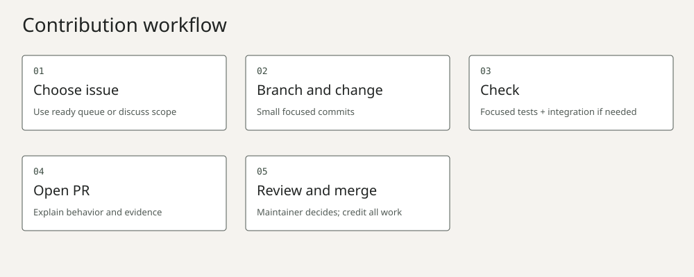

# Contributing

Code, documentation, tests, accessibility, diagnostics and verified build reports all count. No hardware is needed for browser, simulator, SDK host tests or fixture diagnostics. Start with the [ready queue](docs/contributing/ready-issues.md).



Choose the owning repository: hub for website/policies/integration; gateway for MCP/protocol/simulator; Linux SDK for Python applications; ESP32 SDK for firmware/library; Home Assistant for the upstream recipe and diagnostic client. The [responsibility map](docs/visuals/responsibilities.svg) and component README commands explain these boundaries.

Discuss protocol/schema changes, cross-repository interfaces and substantial features in an issue first. A typo fix needs no issue ceremony. Reproduce a bug before changing code; state the expected behavior, observed result and evidence level. Until GitHub activation, local ledgers contain stable IDs. Afterwards GitHub Issues and the Project are authoritative and local JSON is a timestamped exported snapshot, not a second independently editable status database.

Once the planned repository is public, fork it under your account, clone your fork and branch from main:

```sh
git clone https://github.com/YOUR_ACCOUNT/grok-gadgets.git
cd grok-gadgets
git switch -c docs/your-focused-change
uv venv .venv --python 3.13
uv pip install --python .venv/bin/python -r website/requirements.txt
python3 scripts/check.py
.venv/bin/python website/build.py
```

Before activation, use an existing local checkout instead of the clone command. Make small coherent commits; use the issue ID where available. Do not alter global Git identity. Push your branch only when publication/contribution is authorized, then open a focused PR against main using the template.

| Change | Focused checks |
| --- | --- |
| Hub documentation | `python3 scripts/check.py`; website build for public docs/links |
| Website | Node browser-simulator tests, Python website tests and build; inspect keyboard, narrow viewport and reduced motion |
| Gateway | Its locked pytest/Ruff checks and official local MCP demo |
| Linux SDK | Its unittest/Ruff checks; optional gateway integration for transport changes |
| ESP32 SDK | Host checks/contract; compile firmware for firmware changes; USB/PTY integration for transport changes |
| Home Assistant | Locked unittest/Ruff and fixture probe; keep real-home tests separate |
| Cross-repository contract/pins | `.venv/bin/python scripts/check-all.py` with the exact tested sibling combination |
| Publication/migration | Relevant integrity/fake-API regressions; no remote writes |

Hub lint/format uses `uvx --from ruff==0.14.14 ruff check scripts website community` and `ruff format --check` with the same pinned package. Component prerequisites/commands live in their own CONTRIBUTING files. Pure text corrections need usable links and accurate instructions, not invented behavior tests.

A protocol change starts at gateway canonical schemas/fixtures, identifies the new version and updates SDK pins, consumers and integration evidence before promotion. Test a component candidate with other known-good pins, then open a hub compatibility/documentation update; a passing component PR does not automatically change the public website or download.

PRs explain before/after behavior, scope, linked issue, commands/results, docs and remaining limitations. Include a meaningful regression for functional changes. Never label a simulator, fixture, compilation or assistant narrative as physical/native Grok proof. Redact tokens, account details and household state. AI-assisted work must be reviewed, understood and tested by its contributor; generated code gets the same review standards.

@adidshaft reviews and merges; zero mandatory human approvals are planned while there is only one maintainer. A merge is a maintainer decision, not an automatic guarantee. No response SLA, CLA or reward promise is made. Original contributions are Apache-2.0; preserve notices and credit non-code work. Recognition is [opt-in](community/contribution-recognition.md); documentation/tests qualify, and account linking never follows from matching usernames.

Follow [conduct](CODE_OF_CONDUCT.md), [security](SECURITY.md), [governance](GOVERNANCE.md) and [support](SUPPORT.md). Security and conduct reports go privately to adidshaft@kyokasuigetsu.xyz; private GitHub vulnerability reporting will be enabled after creation.
