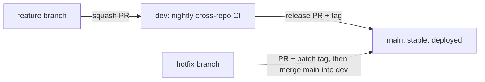

# Contributing

Everyday path: pick a [ready issue](docs/contributing/ready-issues.md), branch from `dev`, run `python3 scripts/dev.py check`, open a small pull request into `dev`.

Use the shared [writing guide](docs/contributing/writing-guide.md) and [review and privacy rules](docs/contributing/review-and-privacy.md). Keep explanations short and use diagrams where they clarify a connection.

You can contribute code, documentation, tests, accessibility fixes, diagnostics or verified build reports. Browser, simulator, SDK host tests and fixture diagnostics need no hardware.


Choose the repository that owns the change. Use the [repository map](docs/architecture/overview.md) and each component README. The [responsibility diagram](docs/visuals/responsibilities.svg) shows the same division.

Discuss protocol/schema changes, cross-repository interfaces and substantial features in an issue first. A typo fix needs no issue ceremony. Reproduce a bug before changing code; state the expected behavior, observed result and evidence level. GitHub Issues are authoritative after the initial migration. The local planning ledgers preserve pre-publication history; the website consumes a timestamped GitHub snapshot. The separate GitHub Project board remains pending.

Fork the repository under your account, clone your fork and branch from `dev`:

```sh
git clone https://github.com/YOUR_ACCOUNT/grok-gadgets.git
cd grok-gadgets
git switch dev
git switch -c docs/HUB-123-your-focused-change
python3 scripts/dev.py setup
python3 scripts/dev.py check
```

Make small commits with one clear purpose. Reference the issue ID when available. Do not change global Git identity. Push your contribution branch. Open a focused pull request (PR) against `dev` with the template.

| Change | Focused checks |
| --- | --- |
| Hub documentation | `python3 scripts/check.py`; website build for public docs/links |
| Website | Node browser-simulator tests, Python website tests and build; inspect keyboard, narrow viewport and reduced motion |
| Gateway | Its locked pytest/Ruff checks and official local MCP demo |
| Linux SDK | Its unittest/Ruff checks; optional gateway integration for transport changes |
| ESP32 SDK | Host checks/contract; compile firmware for firmware changes; USB/PTY integration for transport changes |
| Home Assistant | Locked unittest/Ruff and fixture probe; keep real-home tests separate |
| Cross-repository contract | `.venv/bin/python scripts/check-all.py` with the four siblings on the same branch as the hub (`dev`, or `main` for a release) |
| Publication/migration | Relevant integrity/fake-API regressions; no remote writes |

Run hub lint with `uvx --from ruff==0.14.14 ruff check scripts website community`. Run `ruff format --check` with the same pinned package. Each component lists its requirements and commands in CONTRIBUTING.md. For text-only changes, check links and instructions. Do not invent behavior tests.

Start protocol changes in the gateway schemas and fixtures. Identify the new version. Update SDK pins, consumers and integration evidence before release.

Test the changed component with known-good versions of the other components. Then propose the hub compatibility and documentation update. A passing component PR does not automatically change the website or download.

In the PR, describe the behavior before and after the change. Link the issue. List checks, results, documentation changes and remaining limits. Add a meaningful regression test for changed behavior.

Simulation, fixtures, compilation and assistant narratives do not prove physical or native Grok operation. Remove tokens, account details and household state from shared evidence. Contributors must understand, review and test AI-assisted work. Generated code has the same review requirements.

@adidshaft reviews and merges contributions. With one maintainer, the policy requires zero mandatory human approvals. The maintainer still decides each merge. Passing checks do not guarantee a merge.

We promise no response deadline or reward. No contributor license agreement (CLA) is required. Original contributions use Apache-2.0. Preserve notices and credit non-code work.

Recognition is [opt-in](community/contribution-recognition.md). Documentation and tests qualify. Matching usernames do not prove account ownership.

Commit with an email you are happy to publish, such as your GitHub noreply address.

## Branches and releases

All five repositories use the same two long-lived branches:

| Branch | Holds | Who writes to it |
| --- | --- | --- |
| `dev` | The next release. Default branch; every feature and fix PR targets it. CI tests all five `dev` branches together every night. | Squash-merged PRs once required checks pass |
| `main` | The latest stable release only. Every commit is tagged. The website and the simulator download are built from the hub's and gateway's `main`. | Release and hotfix PRs only |

Short-lived branches start from `dev` and are named `<type>/<ISSUE-ID>-<short-slug>`, for example `fix/GW-021-command-waits-for-ack`. Types are `feat`, `fix`, `docs`, `test`, `ci` and `chore`. Name the change, not the tool that wrote it. Keep a branch to one issue and a few days at most; update it from `dev` before merging.



- **Feature or fix:** branch from `dev`, open a PR into `dev`, squash-merge when checks are green. The PR title becomes the commit message, for example `fix(gateway): wait for ACK in gadgets_command (GW-021)`.
- **Release:** when `dev` is green across all five repositories, open a `release: vX.Y.Z` PR from `dev` into `main` and merge it with a merge commit, never a squash, so `dev` and `main` stay related. Tag that commit `vX.Y.Z` (pre-releases use `vX.Y.Z-alpha.N`). Release components in dependency order: gateway, then the Linux and ESP32 SDKs and Home Assistant, then the hub, whose `compatibility/tested-components.json` records the tested tag set.
- **Hotfix:** for an urgent problem in a release or on the live website, branch `hotfix/<ISSUE-ID>-<slug>` from `main`, open a PR into `main`, merge, tag a patch version, then merge `main` back into `dev`.
- **Cross-repository changes:** use the same issue ID and branch name in each repository. Merge the gateway first and keep it compatible with the previous SDK release. Each repository's `dev` must stay green on its own. A breaking protocol change needs a new protocol version.
- **Never:** force-push or commit directly to `dev` or `main`, bypass required checks, or merge the private pre-publication history.

Versions are independent per repository (SemVer). There are no release branches; if an old release ever needs a patch, create `release/X.Y` from its tag at that time.

Follow [conduct](CODE_OF_CONDUCT.md), [security](SECURITY.md), [governance](GOVERNANCE.md) and [support](SUPPORT.md). Security and conduct reports go privately to adidshaft@kyokasuigetsu.xyz; GitHub private vulnerability reporting is also enabled for security reports.

## Ignore rules and publication privacy

Update `.gitignore` when a tool creates caches, build output, local configuration, logs or credentials. Preserve reviewed sample configurations and the verified public simulator download.

Check new patterns with `git check-ignore`. Review staged files before each commit. Ignore rules do not remove tracked files or past history. Never merge private pre-publication history into a public branch. Use the sanitized public checkout and a public commit email.
