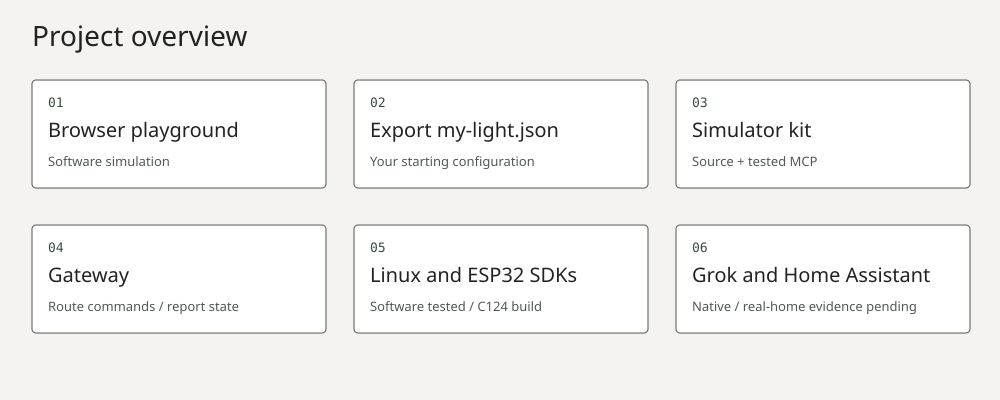

# Grok Gadgets

Open-source tools and separate SDKs for connecting devices to Grok. Start with a virtual light, then build with Linux, ESP32 or Home Assistant.

Documentation uses concise technical English inspired by ASD-STE100. See our [writing guide](docs/contributing/writing-guide.md); formal compliance is not claimed.

**Experimental alpha.** Browser simulation and local MCP are tested. C124 firmware compiles. Inspectable native Grok invocation, mobile and physical-device acceptance remain open.



| Your next step | Start here |
| --- | --- |
| Try without hardware | [Browser and simulator kit](docs/getting-started/simulator-kit.md) |
| Develop a connection | [Gateway](https://github.com/adidshaft/grok-gadgets-gateway) |
| Build a Linux application | [Linux SDK](https://github.com/adidshaft/grok-gadgets-linux-sdk) |
| Build an ESP32 gadget | [ESP32 SDK](https://github.com/adidshaft/grok-gadgets-esp32-sdk) |
| Explore an existing home | [Home Assistant diagnostics](https://github.com/adidshaft/grok-gadgets-home-assistant) |
| Help improve the alpha | [Ready issues](docs/contributing/ready-issues.md) and [contribution guide](CONTRIBUTING.md) |

The [public website](https://grok-gadgets.pages.dev/) is live. Its source lives here. Package releases and firmware downloads have separate release gates.

The ESP32 library is reusable; C124 is the first board example. Other boards need their own hardware handlers, build configuration and verification. See the [repository and device map](docs/architecture/overview.md).

From this hub checkout, with Python 3.13, uv, Node.js 22+ and Git:

```sh
uv venv .venv --python 3.13
uv pip install --python .venv/bin/python -r website/requirements.txt
.venv/bin/python website/build.py
python3 -m http.server 4173 --bind 127.0.0.1 --directory website/dist
```

Open `http://127.0.0.1:4173/index.html#playground`. Change the virtual light, customize it and export `my-light.json`. Nothing in the browser calls Grok or controls hardware. The source checkout includes a verified downloadable kit; with a clean gateway sibling the build refreshes it when source or packaging inputs change, and runs source plus installed default/custom MCP checks before replacing it. A stale kit or failed verification blocks the new build. Keep the last good deployed site until a replacement passes.

Hardware and a Grok account are unnecessary for browser/local simulation. Kit installation requires Python 3.11+ and downloads hashed dependencies. A Grok experiment needs an existing Bot and a supported MCP connection in its execution environment; a cloud Bot cannot run a path that exists only on your Mac. Remote HTTPS/OAuth to local gadgets is unimplemented.

| Evidence | What it establishes |
| --- | --- |
| Gateway and configurable kit | Source and extracted-package MCP software acceptance |
| Linux SDK | Software tests on macOS and Linux container; peripherals/systemd unverified |
| ESP32 SDK | Host logic, simulated USB/PTY and C124 compilation; no flashing or physical observation |
| Home Assistant | Fixture diagnostics and read-only client; no real home or Grok acceptance |
| Website | Static build/link tests, browser interaction and responsive checks |

Run standalone hub checks with `python3 scripts/check.py`, `node --test website/test_simulator.cjs`, and `.venv/bin/python -m unittest discover -s website`. With all four pinned siblings installed, `.venv/bin/python scripts/check-all.py` runs the fourteen integration groups. See [verification matrix](docs/public/support-matrix.md), [architecture](docs/architecture/overview.md), [roadmap](ROADMAP.md), [support](SUPPORT.md), [security](SECURITY.md), [governance](GOVERNANCE.md) and [community](community/README.md).

Original code and vectors: [Apache-2.0](LICENSE), with [NOTICE](NOTICE) and [third-party notices](THIRD_PARTY_NOTICES.md). Independent community project, unaffiliated with xAI, M5Stack or Home Assistant. The owner has retained the current project and repository names.

## History note

Pre-publication commit dates were reconstructed across 29 September–5 October 2026 at the owner’s request. Verification records retain their actual execution dates. See the [history and privacy record](docs/verification/publication-sanitization.md).
