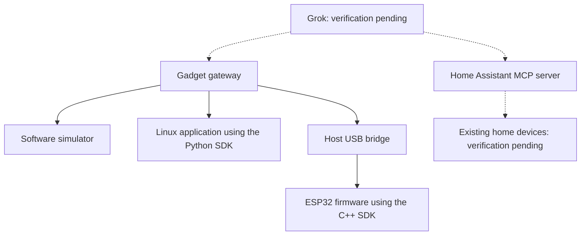
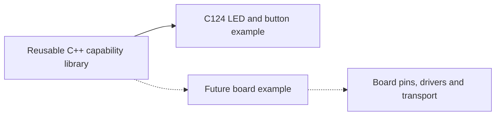

# Repository and device map

The project provides reusable gadget libraries for Grok. C124 is the first ESP32 example. It is not the SDK boundary. Actual Grok and physical-device verification remain pending.

| Repository | Responsibility |
| --- | --- |
| `grok-gadgets` | Website, shared docs, roadmap, community policies and integration checks |
| `grok-gadgets-gateway` | MCP tools, command routing, device protocol and simulator |
| `grok-gadgets-linux-sdk` | Python library and agent for computer-based gadgets |
| `grok-gadgets-esp32-sdk` | Reusable C++ library and board-specific firmware examples |
| `grok-gadgets-home-assistant` | Discovery diagnostics and setup guidance for Home Assistant's own MCP server |

Solid arrows describe implemented software interfaces. They do not establish physical operation. Dotted arrows require external verification. Home Assistant does not need our gateway for its own MCP route.

## Reusable core, separate board examples

The current ESP32 capability library has no board or serial dependency. `GrokGadgets.h` handles capabilities and bounded command results. `GrokCore.h` provides shared utilities. `C124.h` and the example application supply the first board's hardware behavior. The configured firmware build targets C124; Wi-Fi remains future work.

For each new board:

1. Reuse the core library. Keep board names, pins and hardware drivers in the example or adapter.
2. Add the board build configuration and hardware capability handlers.
3. Define the transport to the gateway. Do not assume every board has the same USB interface.
4. Run host and protocol checks, then compile the board example.
5. Record physical tests separately when the board is available.

Add board examples within the ESP32 repository. Add computer examples within the Linux repository. Do not create a new repository for each board. Core tests must cover a custom capability that does not depend on the C124 LED or button. A board is supported only to its recorded evidence level: simulated, compiled or physically verified.

## Protocol and evidence boundaries

The gateway owns canonical protocol 0.1.0. Loopback TCP and the USB bridge use bounded, LF-delimited JSON frames. The host handles credentials; the C124 firmware stores no network credential. Device registration includes boot identity and capabilities. Commands, acknowledgements, state and events have separate roles. Queues and retry caches have finite limits.

Simulation controls require explicit opt-in and are absent from normal MCP tool discovery. A device acknowledgement does not prove a physical effect. No remote tunnel or alternative AI backend is included. A cloud Grok client cannot launch a file on the local computer; authentication and reachability require separate verification.
