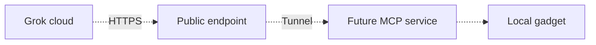
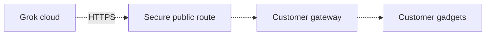
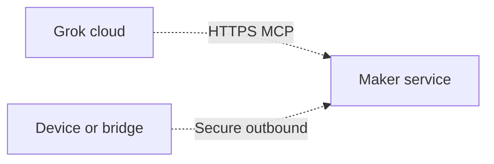

# Hosting and remote access FAQ

Grok Gadgets provides tools and SDKs for an existing Grok Bot. The operator runs the gateway. Grok/xAI runs Grok Bot.

**Current boundary:** the gateway speaks MCP two ways on the operator's computer: stdio, and `serve` at `http://127.0.0.1:8766/mcp` with a local bearer token. Gadgets still connect on loopback TCP (`127.0.0.1:8765`). That HTTP mode is software-tested locally. It is **not** verified with Grok Bot. A cloud Bot cannot open `127.0.0.1`. Public HTTPS is something the operator puts in front of port 8766; this project does not ship TLS or OAuth. Never publish the device port.

You can run local development and simulator tests now. Putting `serve` on the public internet, or connecting Grok Bot to it, needs a separate experiment and is unverified.

## Who hosts the custom MCP server?

The person or organization that runs the Grok Gadgets gateway hosts its MCP server.

| Part | Who runs it? | Current role |
| --- | --- | --- |
| Grok Bot | Grok/xAI | Runs the Bot and its supported client environment. |
| Local gateway | Builder or user | Runs stdio MCP and, if they choose, `grok-gadgets-gateway serve` on loopback. |
| Future product gateway | Customer or product maker | Depends on the product's hosting design. A remote service is not shipped. |
| Project website | Project maintainers, on Cloudflare Pages | Serves docs, downloads and the browser simulator. It does not run a gadget gateway. |
| Home Assistant MCP server | The Home Assistant installation operator | Uses Home Assistant's own MCP route. It does not require our gateway. |

For a Grok Bot **Remote HTTPS** custom MCP route, plan a publicly reachable HTTPS endpoint. A private address, such as `127.0.0.1` or a home LAN address, is not directly reachable from Grok cloud. A public endpoint can route to a private service through a tunnel.

Grok also documents a **Command** custom MCP route. The command runs in the Bot's supported execution environment. A path on your Mac is not a path on the Bot's cloud computer. An operator can install our simulator there. That runs simulator code on the cloud computer; it does not create a gateway service for devices in the operator's home.

Check route availability and authentication in the actual account and client. [Team Bots](https://docs.x.ai/grok-bot/team-bots) documents Remote HTTPS with the Bot's credential or per-person OAuth. [Computer and apps](https://docs.x.ai/grok-bot/computer-and-apps) describes the cloud computer and separately approved local execution.

The [Grok.com custom connector guide](https://docs.x.ai/grok/connectors/custom-mcp-tunneling) explicitly requires public HTTPS and rejects private-address URLs. That is a separate Grok product surface. Its URL rules do not prove Grok Bot account availability or interoperability.

## Who owns and runs the tunnel?

A tunnel forwards requests from a public URL to a process on a private computer. A tunnel provider supplies the public routing service. The gateway operator creates and configures the tunnel. The operator can also run their own tunnel infrastructure.

During a builder experiment, the builder keeps the gateway, tunnel process and host computer running. For a maker-operated product service, the maker operates its public endpoint and any tunnel. Grok is a client of that endpoint. It does not automatically create, host or own the user's tunnel.

**A tunnel provides reachability. It does not add gateway authentication.** Some providers offer separate access controls. Those controls need explicit configuration and a compatible MCP client. A browser login page alone is not an MCP credential flow.

A tunnel does not replace the bearer token. Do not point a tunnel at the gateway's device port (8765). Point it only at the MCP port (8766) if you are running an authorized experiment. That path is unimplemented as a hosted product and unverified with Grok Bot.

See [Grok's custom MCP tunneling guide](https://docs.x.ai/grok/connectors/custom-mcp-tunneling), [Cloudflare Tunnel](https://developers.cloudflare.com/tunnel/) and [Quick Tunnels](https://developers.cloudflare.com/tunnel/get-started/quick-tunnels/). Cloudflare's tunnel agent runs on the operator's host and connects outward to the provider. It does not require a public origin IP or an inbound router port.

Provider features need a separate compatibility check. Quick Tunnels are temporary development routes and do not support Server-Sent Events (SSE). Their optional browser email login cannot authenticate a noninteractive MCP client. Do not assume that every tunnel or access policy supports the selected MCP transport.

## What can a builder do now?

Run the [browser and local simulator](simulator-kit.md). Build a Linux application or compile the ESP32 example. On the gadget host you can `enroll` a device and run `grok-gadgets-gateway serve` so a **local** MCP client can use HTTP. These tasks need no public gateway. Installing dependencies can still need Internet access.

A cloud Grok Bot still cannot see a kit that only exists on your Mac. Native tool invocation still needs its own evidence.

To try reaching local gadgets from a Bot, the operator would run `serve` and publish only `127.0.0.1:8766` over HTTPS they control, with the bearer token in the Bot config. That experiment is **not** done here. [HARD-GROK-REMOTE-001](https://github.com/adidshaft/grok-gadgets/issues/4) tracks activation. Gateway file: `docs/remote-access.md`.

After that work, a compatible tunnel could provide a temporary experiment route:

All dotted paths are future work or unverified integration paths. The builder would run the MCP service and gadget connection on their computer. The tunnel provider would route requests to it. The builder would configure access, inspect actual invocation records, and stop the experiment when finished.

Do not deploy this route with the current alpha. The existing per-device loopback tokens are local controls. They do not provide remote user authorization, TLS or tenant isolation.

## Who hosts it after a hardware product launches?

Two deployment designs remain possible. Both need remote service engineering and verification. Neither design is a shipped Grok Gadgets hosting feature.

### Option A: the customer runs the gateway

The customer keeps a computer or Linux box running at home or work. That computer runs the gateway and connects to the gadgets. Grok reaches a future authenticated MCP endpoint through a secure public route.

The customer operates the host, updates, credentials and network route. A tunnel is one possible route. A reviewed public HTTPS deployment is another. The customer can keep gateway storage under their control. Data sent to Grok still leaves the local system.

If the gateway host stops, this Grok control path stops. Existing local device controls or Home Assistant automations can continue where their own integrations permit it.

### Option B: the maker runs an optional service

The maker operates the public MCP endpoint and gateway service. A device or local bridge creates a secure outbound connection to that service. The customer grants scoped access to their own devices.

The maker must implement tenant and device isolation, consent, scoped credentials and revocation. The maker also owns uptime, updates, support, incident handling and operating costs. A customer can withdraw access. The service must reject requests after revocation.

The current USB example and loopback Linux agent do not implement this Internet connection. A maker service needs new transport and authorization code. A tunnel alone does not supply that code.

| Choice | Benefit | Operator responsibility |
| --- | --- | --- |
| Customer-hosted gateway | Local control and control of gateway storage. Can use existing hardware. | Customer keeps a computer running and maintains access, updates and recovery. |
| Optional maker-hosted service | Central setup and support. Could remove the need for a dedicated customer computer. | Maker pays for operations and protects each customer's devices and data. Devices still need a working outbound route. |

The project plan commits to self-hostable open-source software. It leaves hosted service operation as a future option. A self-hosted baseline with optional maker-hosted convenience is a proposal. It is not a final product hosting decision or an active service.

## What does add access controls mean?

It means implementing and testing the security boundary for remote HTTPS MCP. It is a required future engineering task. Documentation alone cannot complete it.

[HARD-GROK-REMOTE-001](https://github.com/adidshaft/grok-gadgets/issues/4) must cover:

1. Select a trust model that the supported Grok client can use. Evaluate OAuth or scoped credentials.
2. Provide HTTPS with TLS and validate the endpoint configuration.
3. Authorize each user for specific devices and capabilities. Isolate users, devices and tenants.
4. Get user consent before device access. Support credential rotation and revocation.
5. Bound commands, connections, queues and timeouts. Define disconnect and shutdown behavior.
6. Store secrets outside source control. Remove secrets and private device data from diagnostics.
7. Test missing, invalid, expired and revoked credentials. Reject access to another user's or device's resources.
8. Test reconnect, shutdown, command limits and revocation under failure conditions.

Do this work before exposing a gateway. Remote service activation remains blocked until the design, implementation and tests pass. A later live Grok experiment needs separate approval and observable tool results. This guide does not activate a gateway or tunnel.

## Does a passing local test prove the cloud route works?

No. Keep these four checks separate:

| Check | Required evidence | Present boundary |
| --- | --- | --- |
| Local software acceptance | Local MCP client results, simulator assertions and transport tests. | Local stdio and loopback software paths have test evidence. |
| Cloud reachability and Grok invocation | A supported connector with native requests/results or independently retrieved execution logs. Remote HTTPS also needs a public endpoint; Command needs the process in its approved execution environment. | Account and client behavior need direct verification. A Bot-written report is not proof. |
| Remote transport security | Reviewed auth design and passing isolation, revocation, limit and failure tests. | Remote HTTPS MCP/OAuth service is unimplemented. |
| Physical hardware operation | Recorded board, peripheral or home-device observations. | Simulation, firmware compilation and device acknowledgements do not prove physical effects. |

Home Assistant has its own upstream MCP implementation. Its operator must verify that endpoint's authentication, public reachability and Grok client compatibility. The missing Grok Gadgets remote service does not mean that Home Assistant lacks an MCP server.

See the [support matrix](../public/support-matrix.md), [architecture overview](../architecture/overview.md) and [Home Assistant setup guide](https://github.com/adidshaft/grok-gadgets-home-assistant/blob/main/docs/setup.md).

## Sources and scope

Official sources reviewed on 5 October 2026:

- [Grok Bot custom MCP options](https://docs.x.ai/grok-bot/team-bots): Remote HTTPS and Command routes, with credential or OAuth choices.
- [Grok Bot computer and apps](https://docs.x.ai/grok-bot/computer-and-apps): cloud execution and separately controlled local execution.
- [Grok.com custom MCP tunneling](https://docs.x.ai/grok/connectors/custom-mcp-tunneling): public endpoint rules and separate authentication for the Grok.com connector.
- [Cloudflare Tunnel](https://developers.cloudflare.com/tunnel/): a public route to a privately running service.
- [Cloudflare Quick Tunnels](https://developers.cloudflare.com/tunnel/get-started/quick-tunnels/): temporary development routes and provider limits.
- [Cloudflare Tunnel integrations](https://developers.cloudflare.com/tunnel/integrations/): separately configured access controls.

These sources describe platform capabilities. They do not establish Grok Gadgets support. The [remote implementation issue](https://github.com/adidshaft/grok-gadgets/issues/4) records the project's missing service. The [roadmap](../../ROADMAP.md) keeps the local core self-hostable and treats hosting as a future option.
