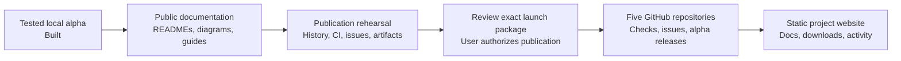
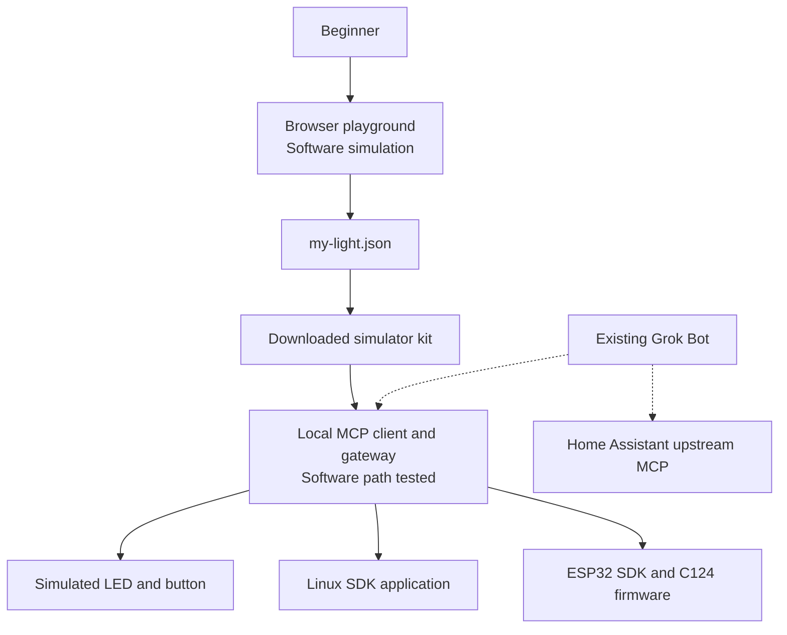
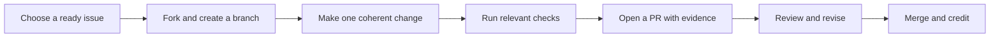

> Internal execution plan. Public activation is pending. Host paths are normalized; current status is in verification/launch-status.md.

# Grok Gadgets — GitHub launch and contributor experience

**Prepared:** 5 October 2026, Asia/Kolkata  
**Decision:** The tested local alpha is built. Prepare a clear, welcoming public alpha before publishing.  
**Owner:** `adidshaft`, confirmed with the signed-in GitHub CLI.  
**Working names:** Keep Grok Gadgets and the five existing repository names. The user deferred the naming decision; it does not hold up local preparation.  
**Contact:** `adidshaft@kyokasuigetsu.xyz` for private conduct reports; GitHub private vulnerability reporting for security, with that email as fallback.  
**Community:** [r/GrokGadgets](https://www.reddit.com/r/GrokGadgets/).  
**License:** Apache-2.0 for original code, retaining applicable dependency and asset notices.

This is an internal execution plan and audit record. It does not authorize public repository creation, pushes, releases, deployment, live community changes, paid services, or automation activation. Public documentation must be written for a newcomer without access to our chats, computer, or private evidence.

**Authorization update, 5 October 2026:** The user additionally requested a simulation check through computer use with Grok Bot. Stage G1 below is authorized within the existing signed-in account and dedicated test Bot. This permits simulation test prompts and supplying the reviewed simulator kit/configuration through a supported connection. It does not authorize real-device control, unrelated connector changes, public network exposure, new paid services, or public launch.

## 1. What is ready today?

The local software is a usable alpha. It is ready for the next stage of open-source preparation. It is not yet a fully verified consumer product or a launched public ecosystem.

| Area | Audit result | Meaning for launch |
| --- | --- | --- |
| Gateway and simulator | Local MCP and software transport checks pass | Can be offered as a clearly labeled software alpha |
| Browser playground and configurable kit | Export correction verified; protected defaults remain intact | A useful first experience without hardware |
| Linux SDK | Source and installed custom example checks pass; earlier Linux container evidence exists | Explain tested environments and unverified peripherals/systemd |
| ESP32 SDK | Host, protocol, and simulated USB integration pass; earlier firmware compilation evidence is recorded | Buildable experimental C124 firmware; physical behavior still unverified |
| Home Assistant | Diagnostic client and fixtures pass | A compatibility/diagnostics project; real-home and Grok acceptance remain open |
| Website | 50 pages build and pass local link/fragment checks; desktop and phone-width views inspected | Preserve the current design, then improve navigation and public information |
| Repository foundations | All five have README, CONTRIBUTING, SECURITY, Apache-2.0 LICENSE, NOTICE, and change history | Improve their content; do not recreate the project |
| Public contribution experience | Several local-only links, brief guides, pending contacts, and no ready contribution queue | Finish before inviting contributions |
| Public GitHub setup | No remotes or release tags; none of the five proposed repositories resolved under the authenticated owner | Creation and activation are future, explicitly approved steps |
| Actual Grok and physical operation | Independent native Grok invocation evidence, mobile, physical C124, and real-home evidence remain open | Keep these limitations visible in README, website, and releases |

### Fresh verification from this audit

- All **14** groups in `.venv/bin/python scripts/check-all.py` passed.
- Included **73 gateway**, **6 browser simulator**, **4 simulator-kit**, and **12 website** tests, alongside community, Linux, Home Assistant, installed-package, and ESP32 checks.
- All **11 publication integrity tests** passed separately.
- `scripts/build-simulator-kit.py --check` confirmed the current kit and hashes.
- `scripts/verify-publication.py --require-current` verified **25 internal candidate artifacts**, five exact source archives, and five complete recovery Git bundles.
- A bounded Max-reasoning review confirmed the actual saved browser export, installer acceptance with unchanged defaults, rejection of the old overwrite path, local MCP receipts, and matching provenance.
- Desktop and a requested 390 px phone viewport were inspected. The phone document had no horizontal overflow. The current browser UI displays the corrected `my-light.json` instructions.
- A new browser download-event capture timed out in the inspection tool. This audit does not claim a newly captured download or a new complete installation from that attempt; the inspected prior actual-download evidence and fresh regression tests support that flow.

The firmware was not reflashed, hardware was not exercised, and live Grok accounts were not operated in this audit.

Recorded corrected playground, from the build-verification evidence inspected during this audit:

The historical audit referenced an export screenshot outside this checkout. A fresh, actual browser screenshot is now recorded in [visual sources](visuals/README.md); it does not substitute for native Grok invocation evidence.

This screenshot documents software simulation and the corrected instructions; it is not proof of a Grok session or physical device.

### Exact audited source

| Repository | Audited main commit | Commit count |
| --- | --- | ---: |
| grok-gadgets | `fdc5472d4bb061aac26568ac112d4bc92fbd9adf` | 35 |
| grok-gadgets-gateway | `fa062a1db36cfbea90b807b9430d28d153bf585d` | 10 |
| grok-gadgets-linux-sdk | `ce897eee8f259a2ba82afad37e7a607c56f2f6e1` | 8 |
| grok-gadgets-esp32-sdk | `5ca2e5d7ebe470fef10fc5584287cd0c8b624c65` | 9 |
| grok-gadgets-home-assistant | `a8b2370b7e82e136511b6299e1317eb80915d012` | 4 |

There are **66 incremental commits**. All tracked source is clean; the hub has pre-existing untracked `assets/`, which must remain untouched unless its specific contents are intentionally reviewed.

Local audit evidence, relative to `<workspace>/grok-gadgets`:

- `artifacts/verification/20261004T200506-1791144306036440000/results.json`
- `docs/verification/simulator-export-onboarding.md`
- `artifacts/verification/export-onboarding/acceptance.json`
- `artifacts/publication/latest.json`
- `artifacts/publication/20261004T194202-1791142922229408000/manifest.json`

Do not publish those folders wholesale. Convert relevant results into concise, redacted public verification documents.

## 2. The launch in one picture



The first public release should say **experimental alpha**. Publication can happen before physical or universal mobile verification, provided every relevant claim is accurate and those unfinished paths remain visibly tracked.

| Required before a public alpha | Can remain open with clear labeling |
| --- | --- |
| Audited publishable history and files | Physical C124 acceptance |
| Accurate README, install commands, limitations, and license | Actual Grok invocation receipts and mobile checks |
| Working public links and contact routes | Real Home Assistant installation/device evidence |
| Reproducible tests and release artifacts | Real Linux service/peripheral acceptance |
| Useful issue forms and contribution instructions | Independent human installation |
| Reviewed GitHub/Pages settings and explicit publication approval | Remote HTTPS/OAuth, Wi-Fi provisioning, voice entry points |

Naming review is deferred at the user's request. Retain the current names while preparing all of the above; record its eventual disposition before final public activation. Do not rename repositories or contact a third party during this preparation.

## 3. Keep the five-repository structure

Use the existing repositories under `<workspace>`. Keep the website in the hub. A project website does not require a sixth repository.

All URLs below are **planned destinations**, not claims that the repositories already exist.

| Repository under adidshaft | Proposed GitHub About description | Homepage destination |
| --- | --- | --- |
| grok-gadgets | Open-source tools and SDKs for connecting devices to Grok. Start with a simulator, explore the architecture, and contribute. Experimental alpha. | Project website |
| grok-gadgets-gateway | MCP gateway and configurable simulator for Grok-connected gadgets, with versioned device contracts and local USB/TCP transports. | Gateway guide |
| grok-gadgets-linux-sdk | Python SDK and local device agent for Linux gadget applications targeting Grok through the Grok Gadgets gateway. | Linux guide |
| grok-gadgets-esp32-sdk | C++ SDK and experimental AtomS3 Lite C124 USB firmware for Grok Gadgets. Build verified; physical testing pending. | ESP32 guide |
| grok-gadgets-home-assistant | Home Assistant MCP setup guidance and read-only compatibility diagnostics for Grok. Reuses the upstream server. | Home Assistant guide |

Planned repository URL pattern: `https://github.com/adidshaft/<repository>`.

Planned website: `https://adidshaft.github.io/grok-gadgets/`. Use GitHub Pages project hosting; no domain purchase or paid infrastructure is required for this plan. Test that project-path prefix explicitly.

Suggested topics:

| Repository | Topics |
| --- | --- |
| Hub | grok, mcp, open-source, iot, home-automation, developer-tools |
| Gateway | grok, mcp, python, iot, simulator, serial |
| Linux SDK | grok, python, linux, raspberry-pi, iot, sdk |
| ESP32 SDK | grok, esp32, esp32-s3, arduino, m5stack, sdk |
| Home Assistant | grok, home-assistant, mcp, home-automation, python |

Descriptions and topics must describe intent and scope without claiming unverified compatibility. Do not label the ESP32 project as an ESPHome integration unless one is actually supplied.

## 4. Make each README answer the obvious questions

A newcomer should understand the purpose, status, first action, and contribution path without reading a planning document.

### Shared README structure

1. **Identity and one-sentence purpose.** Use the approved community artwork, subject to the deferred public branding decision.
2. **A short honest status line.** Experimental alpha, supported software path, and the most relevant unverified boundary.
3. **One explanatory visual.** A real simulator screenshot or simple architecture diagram, with a caption and useful alt text.
4. **Choose your next step.** Try it, build with it, read the docs, or contribute.
5. **Requirements.** Exact runtime, tools, host, optional hardware, and whether a Grok account is involved.
6. **Copy-and-run example.** One complete path from an empty folder with expected output.
7. **What works today.** A compact evidence/compatibility table, not a promotional feature wall.
8. **How this component fits.** Small diagram and links to the relevant siblings.
9. **Troubleshooting and limitations.** Common actionable errors, with private-data guidance.
10. **Contribution and support.** CONTRIBUTING, issue chooser, security route, roadmap, and community.
11. **License and acknowledgments.** Apache-2.0 original code, third-party notices, independence statement.

Use a small set of real badges: CI status once active, license, and an actual prerelease link once published. A static experimental-alpha label can exist beforehand. Never fabricate stars, contributors, release versions, coverage, downloads, or compatibility badges.

### Repository-specific first experiences

| Repository | First useful success | Required explanation |
| --- | --- | --- |
| Hub | Try the browser light, export my-light.json, find the matching kit instructions | Browser simulation makes no Grok or hardware calls |
| Gateway | Run the official local MCP demonstration and observe discovery, command, state, and failure handling | Local MCP success is not native Grok proof |
| Linux SDK | Start from one small capability example and obtain an acknowledged state through a separately installed gateway | Distinguish the reusable library from the running agent and gateway |
| ESP32 SDK | Build the exact C124 example and identify the resulting firmware; follow a separate hardware checklist | Typical ESP32 firmware is not Linux; compilation is not physical validation |
| Home Assistant | Run the fixture probe, then understand the optional real-endpoint procedure | The probe discovers compatibility; it does not itself control the home |

### A short hub introduction to refine during implementation

> Grok Gadgets is an open-source toolkit for connecting devices to Grok. Try a virtual light in your browser, build a gadget with the Linux or ESP32 SDK, or explore the Home Assistant integration.
>
> This is an experimental alpha. The simulator and local MCP software are tested; native Grok invocation evidence, mobile behavior, and physical hardware verification remain in progress.

Do not promise a five-minute install until timed clean-room trials justify that claim. Provide an explicit download-and-run route for beginners and a separate clone-and-develop route for contributors.

### Public link policy

- Inside one repository, use relative Markdown links.
- Across repositories, use the actual approved GitHub URL; sibling paths such as `../grok-gadgets-gateway/README.md` do not provide the intended cross-repository link on GitHub.
- Website links must work at the project subpath, including downloads, images, anchors, and directly opened deep pages.
- Versioned integration documentation must identify the component commit/tag it describes.
- Replace private-machine commands, chat references, and “owner pending” prose in public-facing instructions.
- Preserve historical design plans with an obvious “historical plan” notice and a link to current status, instead of pretending their original “not started” text describes today.

## 5. The visual documentation package

Keep the current restrained website design and architecture motion. Build a small, reusable set of explanatory assets rather than filling every section with decoration.

| Asset | What it explains | Format and location |
| --- | --- | --- |
| Project overview | The gateway, two SDKs, and direct upstream Home Assistant route | Editable Mermaid plus accessible SVG in hub docs |
| “Try without hardware” sequence | Customize → export my-light.json → inspect kit → run local MCP demo | Four-step SVG and real UI screenshot |
| Gateway command lifecycle | Requested, accepted, device reports execution, physical observation | Small flowchart with simulated/physical labels |
| Repository responsibility map | Where to put code, docs, tests, and issues | Diagram plus a text table |
| Contribution workflow | Find issue → branch → change → check → PR → review → merge | Mermaid/SVG with a short text equivalent |
| C124 reference | Exact board, USB cable, RGB LED, button, and evidence status | Correct technical drawing or permitted verified photograph |
| Support matrix | Host/runtime, build/test evidence, hardware/mobile status | Markdown table generated from maintained records |
| Release evidence | What was tested at each published commit | Compact table; charts only when there is useful measured data |

Use original vector diagrams for technical explanations. AI-generated art may be used for optional decoration, but never as evidence of wiring, a real device, measured performance, a passing test, or a working Grok session. Do not manufacture product screenshots.

Keep diagram source beside the rendered file. Include alt text, visible labels, a legend where needed, and a plain-language equivalent. Static GitHub READMEs should not depend on JavaScript, autoplay, hover, or animation. If a short demo animation is added, provide a static poster and text steps.

Example architecture, explicitly separating verified local software from pending integrations:



The dotted paths need actual Grok acceptance. Linux peripherals, physical C124 behavior, and real-home operation need their own evidence. The browser does not control a real device, and Home Assistant need not be routed through a redundant gateway.

The dotted Grok-to-local-device path also requires missing connectivity work: a cloud Bot cannot launch a filesystem path on the user's Mac. Reaching local gadgets requires a separately implemented, reviewed, and approved authenticated reachable route; the remote HTTPS/OAuth transport is currently unimplemented. The earlier Bot-reported simulator ran on the Bot's cloud computer and does not establish a route to local hardware. The new configurable kit has not yet been tested inside Grok.

## 6. Contribution and governance documents

### CONTRIBUTING.md

The hub owns the canonical contribution process. Component guides contain their own setup/check commands and link to shared policies. Keep root-level files discoverable without a sixth shared-policy repository.

The guide must explain:

- How to choose the right repository and issue type.
- Which changes need an issue first: interfaces, protocol changes, substantial features. Small typo fixes should not need a ceremony.
- How to fork, clone, branch, install dependencies, run a focused check, and open a PR.
- Which checks are required for docs-only, website, gateway, Linux, ESP32, and Home Assistant changes.
- How to provide expected behavior, observed evidence, and a focused regression for functional changes.
- What hardware is optional; how contributors without hardware can help.
- How protocol/schema changes propagate to pinned SDK copies and compatibility manifests.
- How to review, respond to feedback, resolve conflicts, and get a change merged.
- How contributors are credited, including documentation and test work.
- Apache-2.0 contribution terms without introducing an unrequested CLA or sign-off system.
- Responsible use of AI assistance: the contributor remains accountable; generated test claims and unreviewed code are not evidence.

Example flow:



### Other files

| File | Required final content |
| --- | --- |
| LICENSE | Existing Apache-2.0 text, preserved |
| NOTICE | Original attribution and required notices, consistent with shipped material |
| Third-party dependency/asset notices | Actual versions, licenses, source locations, and distribution obligations |
| CODE_OF_CONDUCT.md | Clear behavior rules, proportionate enforcement, private email, appeal path, no invented moderation team |
| SECURITY.md | Actual private reporting route, supported alpha scope, redaction guidance, and disclosure process |
| SUPPORT.md | GitHub issues for actionable defects; Reddit for discussion; private routes for security/conduct |
| GOVERNANCE.md | Maintainer responsibilities, decisions, review, conflict resolution, and how maintainership can expand |
| ROADMAP.md | Human-readable milestones and links to live tracked work after publication |
| CHANGELOG.md | Current meaningful changes and known limitations |
| AGENTS.md | Repository boundaries, checks, small commits, publication authority, and Max reasoning for research subagents |
| .github/CODEOWNERS | Actual authorized maintainer, initially @adidshaft; no fictitious team |

Use local component policy stubs linking to the canonical hub where appropriate. Add project-specific security details locally. Confirm GitHub detects the intended community files after publication.

The private email is for reports that should not be posted publicly. Reddit is not a private security channel. Do not promise a response SLA the maintainer has not agreed to.

## 7. GitHub issues, milestones, and one project board

The existing migration plan has **47 records: 35 done and 12 blocked**. These are records across repositories, not 47 unique unfinished features. Some hub coordination items intentionally refer to component work.

### Fix migration before using it

The current generator initializes every `github_number` to null. Make the migration resumable and idempotent before any public execution:

1. Key each mapping by owner, repository, and stable local issue ID.
2. Preserve known GitHub numbers and URLs on regeneration.
3. Embed a stable local-ID marker in issue bodies.
4. On a partial failure, reconcile existing issues before creating another.
5. Create labels and milestones before issues that depend on them.
6. Create issue records before converting cross-repository dependency links.
7. Verify every mapped issue remotely, then mark migration complete.
8. Keep a timestamped, inspectable dry-run report and restore plan.

A rerun must create zero duplicates and must not erase mappings or close unrelated issues. Test interrupted migration, stale mappings, collisions, label gaps, and resumption with fake API fixtures before enabling remote writes.

### Labels

Preserve the useful existing vocabulary; add missing `integration` and `simulator` labels before migration. Add descriptions, not just colors.

| Group | Labels and use |
| --- | --- |
| Work type | bug, feature, docs, research, maintenance |
| Area | protocol, gateway, linux, esp32, home-assistant, website, community, integration, simulator |
| Priority | P0: urgent confirmed impact; P1: release/important feature; P2: normal improvement |
| Help | good first issue, help wanted, needs hardware |
| State | Use the Project status field; optionally a blocked label with a written dependency |

Keep `good first issue` and `help wanted` spelled as GitHub recognizes them. Do not label credential-dependent, hardware-dependent, or undefined architecture work as a beginner task.

### Milestones and statuses

Preserve historical M0–M9/MH identifiers in migrated evidence. Give new public milestones readable titles:

| Milestone | Exit condition |
| --- | --- |
| Public alpha launch | Public docs, checks, issues, accurate prereleases, website, and support routes verified |
| First independent software setup | Another person reproduces the documented simulator and contributor setup |
| Verified Grok connection | Inspectable native invocation evidence for the exact supported route |
| First physical C124 build | Flash, LED, button, disconnect/reconnect, recovery, and observation recorded |
| Real Linux and Home Assistant | Selected real host/service/peripheral/home paths verified |
| Remote connection and provisioning | Reviewed authenticated HTTPS/OAuth/provisioning design and tested implementation |

Create one user-owned GitHub Project, “Grok Gadgets”, containing work from all five repositories. Recommended fields: Status, Priority, Component, Milestone, Local ID, Evidence needed, and Blocked by. Recommended views: Roadmap, Ready to contribute, Needs hardware, Active work, and Done.

Statuses: Proposed → Ready → In progress → Review → Done, with Blocked used only when a concrete dependency exists. Existing done items become closed historical issues with their original local IDs and evidence. Existing blocked items stay open with their dependency.

Do not close a whole milestone merely because one component passed. The publication work and the unverified product integrations are separate milestones.

Resolve the current GW-004 milestone value `M5/M8` before migration: select one primary milestone and link the other dependency. Do not create a stray combined milestone absent from the canonical manifest.

### Seed a useful contribution queue

The current done/blocked inventory does not give a newcomer enough ready work. During preparation, scope and verify at least three small, genuinely ready issues. Candidate topics to check against the current source:

- A plain-language glossary of gateway, SDK, MCP, state, event, and simulation.
- A concise, tested troubleshooting table mapping common simulator errors to fixes.
- A documented SDK example enhancement that runs entirely in software.
- A focused accessibility or keyboard-flow improvement found during the launch review.

Do not invent defects or reopen finished work to fill a quota. Each chosen issue needs an exact starting file, reproducible current behavior, expected result, acceptance criteria, and check command.

Track Windows/Intel Mac install verification, real C124 acceptance, real systemd, and real Home Assistant as separate contributor opportunities with their actual prerequisites.

### Issue and PR forms

- Bug: version/commit, component, host/runtime, simulator vs physical device, reproduction, expected/actual result, redacted logs.
- Feature: use case, proposed behavior, component, scope, and compatibility impact.
- Documentation: page, what was confusing, attempted step, and suggested improvement.
- Hardware verification: exact model, firmware hash, steps, observed result, safe redacted evidence.
- Security: direct to private reporting, not a public issue body.
- PR: linked issue, behavior before/after, scope, checks/evidence, documentation updates, and remaining limitations.

Keep forms short. A question should not require a full bug template. Add issue-chooser links to support and security routes.

## 8. Website and GitHub must stay consistent

Preserve the original architecture scene and motion. The public website should let someone try the project, understand its limits, and find a first contribution.

Required improvements:

- Add clear, visible links to GitHub and Contribute without crowding the homepage.
- Give Linux its own direct starting link alongside ESP32; the current “build a gadget” entry mentions both but links only to ESP32.
- Organize documentation by task and component instead of exposing generated filenames as navigation labels.
- Turn the roadmap into readable stages with links to real issues, open dependencies, and an obvious “ready to contribute” view.
- Replace local-only status and pending-owner copy when each public step actually becomes true.
- Retain simulation disclosures, kit provenance, and the difference between code execution and physical observation.
- Provide public release/download links tied to exact versions.
- Include community guidelines, CONTRIBUTING, private-report routes, and the canonical Reddit link.
- Review small scene labels, contrast, touch targets, and fixed-footer clearance at phone widths; preserve keyboard access and reduced-motion behavior.
- Add useful page titles/descriptions, a social preview, favicon, sitemap, and sensible missing-page behavior.
- Keep setup text copyable. No important instruction should exist only inside an image.

### Source of truth after publication

| Information | Authoritative source | Website behavior |
| --- | --- | --- |
| Code and documentation | Reviewed repository commits | Build from approved sources |
| Protocol | Gateway schemas and versioned fixtures | Identify the exact consumed version |
| Tested component combination | Hub compatibility manifest | Display tested commits/versions |
| Issue status and assignment | GitHub Issues and Project | Read a validated, timestamped snapshot |
| Milestone scope | Maintained roadmap plus linked GitHub milestone | Display actual open/closed work |
| Releases | Actual GitHub prereleases/releases | Display the correct channel and date |
| Community policy | Hub Markdown | Render/link the same material |

After migration, do not maintain two independently editable issue-status databases. Keep local JSON as a generated/exported snapshot with stable IDs and mappings. Stage the transition so existing build/check tooling continues to work.

### Stars and contributors

The existing activity module already distinguishes live, cached, fixture, and unavailable data. Keep that behavior and test the live fetch only after the repositories exist.

- Stars: label the sum across repositories; it is not a count of unique people.
- Open issues: exclude pull requests.
- Contributors: deduplicate GitHub numeric identities and explain the metric.
- Active contributors: current implementation means non-bot contributors with an eligible merged PR in the last 90 days. Explain why early direct commits may not count.
- Show last successful refresh and stale/unavailable states.
- Show no fabricated progress percentage. Stage counts and linked acceptance criteria are more useful.
- Define pagination/rate-limit behavior. The current bounded fetch deliberately fails closed when its caps are exceeded; keep that honesty and plan scaling when needed.

Prepare a manual refresh/deployment workflow first. If a recurring refresh is later authorized, start with a bounded daily run rather than unnecessary hourly traffic; show its freshness limit accurately. Align the current one-hour cache classification with the chosen schedule, or retain a clearly labeled cached state. No client-side secret and no unattended automation are activated by this plan.

## 9. Git workflow, ownership, and checks

Keep `main`, short-lived feature branches, and explicit version tags. Do not add permanent dev/prod branches solely for appearances. A public website deployment is an environment built from a reviewed commit; it does not need a separate product-code branch.

Enable Issues in all five repositories, use Discussions only in the hub if enabled, and disable Wiki so instructions remain reviewable in the source. Keep the five existing histories; do not replace them with a single initial commit.

Prepare a real GitHub ruleset payload per repository. The current `publication/desired-protections.json` is a proposal, not a ready-to-submit GitHub API payload.

Initial main-branch rules:

- Require a pull request and passing required checks.
- Require resolved conversations and an up-to-date branch where supported by the chosen settings.
- Block force pushes and branch deletion.
- Use zero required human approvals while there is only one maintainer; do not create an impossible self-approval gate.
- Configure real code ownership; increase review requirements when a second maintainer actually joins.
- Choose a history policy that preserves meaningful incremental commits. Avoid routine squash merging an entire substantial build into one commit.

Public personal repositories can use repository rulesets on GitHub Free. Verify the applied rules and real check contexts after the first hosted run. [GitHub repository rulesets](https://docs.github.com/en/repositories/configuring-branches-and-merges-in-your-repository/managing-rulesets/creating-rulesets-for-a-repository), [available rules](https://docs.github.com/en/repositories/configuring-branches-and-merges-in-your-repository/managing-rulesets/available-rules-for-rulesets).

### Actual current check names

| Repository | Current hosted job names | Additional launch acceptance |
| --- | --- | --- |
| Hub | checks | Add a named cross-repository integration job |
| Gateway | gateway-checks | Keep official MCP and simulator acceptance |
| Linux SDK | linux-sdk-checks | Exercise optional gateway integration in the cross-repository job |
| ESP32 SDK | esp32-host, esp32-firmware | Add actual simulated USB/PTY consumer integration to cross-repository acceptance |
| Home Assistant | home-assistant-checks | Keep fixture checks distinct from real-home evidence |

Do not apply the hub's `checks` name to every sibling. Confirm full status-context names and their originating GitHub Actions app from actual runs before making them required.

### CI layout

Keep independent repository checks fast and usable from a single checkout. Add a separate hub integration workflow that checks out the five repositories as siblings at exact compatibility SHAs.

```text
runner-workspace/
  grok-gadgets/                 hub commit being tested
  grok-gadgets-gateway/         exact approved component commit
  grok-gadgets-linux-sdk/       exact approved component commit
  grok-gadgets-esp32-sdk/       exact approved component commit
  grok-gadgets-home-assistant/  exact approved component commit
```

Current standalone CI is not known to be broken. Its coverage is narrower: Linux skips five optional gateway tests, ESP32 does not run its gateway/PTY consumer check, and hub CI does not run the full 14-group integrated acceptance. Close that coverage gap without forcing every documentation contributor to clone all five repositories.

For component changes, test the candidate component SHA together with the other known-good pins. A successful component change does not automatically promote the website: open a hub compatibility/documentation update, test that exact combination, and merge it before promotion.

Use explicitly read-only token permissions for checks, including gateway and ESP32. Pin verified action commits, disable persisted checkout credentials when not required, set timeouts, and bound concurrency. Fork PR tests must not receive deployment/project-write secrets. Never run untrusted PR code through a privileged workflow just to obtain credentials. [GitHub Actions secure-use guidance](https://docs.github.com/en/actions/reference/security/secure-use).

Use standard public GitHub-hosted runners; do not select billed larger runners or add paid services. Broader OS coverage can follow measured need. Start with the documented Python baseline, a supported current Python version, firmware compilation, and the existing verified host paths. Do not label Windows or Intel Mac installs verified until they pass.

## 10. Licenses, history, and public artifacts

All five repositories already contain matching full Apache-2.0 license text and original-code notices. Preserve them. Add or improve discoverable links and package metadata rather than replacing licenses arbitrarily.

Audit the actual distributed contents:

- Python wheels and source packages: license/notice inclusion, dependency attribution, source links, correct version.
- Simulator ZIP: source, wheel, dependency hashes, installer, configuration schema, notices, and provenance agree.
- ESP32 firmware: review the documented dependency licenses, source availability, and any required relink/source material before uploading binaries.
- Website and README artwork: record origin, usage terms, and which assets are original versus third-party trademarks.
- Screenshots, transcripts, and diagrams: omit account details and unsupported product claims.

The hub's current third-party notice references generation notes under untracked `assets/`. Publish a sanitized provenance record or revise that reference so recipients can inspect it; do not copy the entire private/source asset folder just to make the link resolve.

Source repository publication and firmware-binary distribution are separate decisions. If binary redistribution preparation is incomplete, publish source and reproducible build instructions only after approval, with the binary release explicitly pending.

### Publishable history review

An initial push of main includes its reachable history, including files deleted in later commits. A clean working tree, a website allowlist, or a token-pattern scan alone does not establish that the whole history is ready for publication.

The bounded audit found no limited known key/token signatures in the scanned reachable main-history text/commit objects. It did find personal machine paths and internal-workflow references, and personal contact metadata in commits. This is a review requirement, not a claim that a secret was leaked.

Review at least:

| Surface | Review action |
| --- | --- |
| Current tracked files | Remove private paths, chat-only instructions, account evidence, and accidental fixture credentials |
| Reachable main history | Inspect deleted files, commit messages, binary/media history, author/committer identities, and large blobs |
| Other local refs | Keep agent turn-diff refs, experiment branches, and unrelated work private |
| Untracked assets | Preserve; selectively include only reviewed assets with provenance if needed |
| Ignored evidence | Keep raw Grok captures, household data, private mappings, and host logs out of public release uploads |
| Public manifests | Use portable source identities and hashes instead of private absolute paths |

Known files requiring a public-content pass include hub `compatibility/tested-components.json`, `publication/issue-migration.json`, historical planning/handoff/status documents, Linux `docs/verification/hardening.md`, and Home Assistant `planning/issues.json`.

Do not silently rewrite history or change global Git identity. Preserve the 66-commit history by default. If an actual credential or sensitive record is found, stop publication of affected refs, explain the concrete finding without exposing its contents, and prepare a reviewed remediation. Head-only edits do not erase history.

### Internal recovery versus public release

The current package includes complete Git bundles created with `--all`. They are useful private recovery material, not default public release assets.

| Keep private | Eligible for a reviewed public release |
| --- | --- |
| Complete recovery .bundle files | GitHub source archive for the approved tag |
| Agent/internal refs and experiment branches | Reviewed Python wheels/source packages |
| Raw local/account verification evidence | Inspectable simulator ZIP and checksum manifest |
| Unredacted machine inventories and paths | Public compatibility/evidence summary |
| Personal identity-linking records | Firmware only after redistribution review |
| Unreviewed source asset folders | Reviewed website assets and original diagram sources |

Use an explicit public asset allowlist. Never upload all 25 internal artifacts merely because the integrity verifier accepts them. Never use a blind `git push --all` or `git push --mirror`. Check reachable file sizes before pushing; GitHub blocks individual files over 100 MiB. [GitHub large-file limits](https://docs.github.com/en/repositories/working-with-files/managing-large-files/about-large-files-on-github).

## 11. Releases and Pages deployment

### Versioned alpha releases

The unpublished coordinated candidate is `0.1.0-alpha.1`; Python package spelling may be `0.1.0a1`. Protocol version `0.1.0` is a separate contract identifier. Document that distinction.

Before any tag:

1. Freeze final reviewed source commits and record the tested component combination.
2. Refresh public release notes. They currently cite 21 gateway tests and 12 integrated groups; the current audited results are 73 and 14.
3. Build from those committed sources, not a dirty workspace.
4. Validate package contents, checksums, manifests, license notices, and compatibility.
5. Inspect the public asset allowlist independently.
6. Prepare local release payloads: title, notes, tag target, asset list, and prerelease status.
7. After approval, create GitHub draft prereleases, attach and verify the approved assets, then publish only the selected tags and assets.

Each repository owns its releases; the hub records which versions work together. Future components can version independently. A release tag must not be moved after publication.

The final evidence manifest should be generated after the final source commit. Avoid a self-referential cycle of committing a manifest that claims to certify the very commit containing it. Keep external candidate evidence separate from source and regenerate it when source changes.

GitHub supports immutable releases. If enabled, finish and verify all draft assets before publication because the published release locks its assets and associated tag. Treat build attestations as a later enhancement unless the current workflow actually builds and attests those artifacts. Do not present locally uploaded files as Actions-built artifacts. [Immutable releases](https://docs.github.com/en/code-security/concepts/supply-chain-security/immutable-releases), [artifact attestations](https://docs.github.com/en/actions/how-tos/secure-your-work/use-artifact-attestations/use-artifact-attestations).

### Website deployment

Prepare a hub Pages workflow with manual dispatch first:

- Run on the approved main source, with exact component pins where required.
- Build and validate the website, docs, download provenance, and project subpath.
- Upload only `website/dist`.
- Give the deployment job `pages: write` and `id-token: write`; keep build/check jobs read-only.
- Use the `github-pages` environment restricted to main.
- Do not configure a sole maintainer into an impossible self-review restriction.
- Make the deploy job explicitly depend on the successful build/check job for the same selected commit, for example with `needs: build` when that job includes all required gates. A different workflow's earlier success is not sufficient.
- Preserve a previous known-good site artifact/commit for rollback.

After deployment, verify the actual HTTPS URL, images, menu, deep links, configuration export, kit download/checksum, releases, public policies, and project activity state. Static Pages hosting does not run the gateway, Grok connector, Reddit bot, or account-linking service. [GitHub Pages](https://docs.github.com/en/pages/getting-started-with-github-pages/what-is-github-pages), [custom Pages workflows](https://docs.github.com/en/pages/getting-started-with-github-pages/using-custom-workflows-with-github-pages).

## 12. Execution stages and commit checkpoints

Complete L0–L7 locally and perform the authorized G1 Grok Bot simulation check before the final publication handoff. Record a precise limitation if G1 cannot obtain reliable execution evidence; continue all independent preparation. Mark future publication stages as planned; do not report this document as their execution.

| Stage | Work | Acceptance and commit boundary |
| --- | --- | --- |
| L0 — Baseline | Read applicable instructions, record current heads, create a labeled launch tracker and journal | Preserve unrelated files; baseline and scope committed |
| L1 — Public metadata | Owner/repository manifest, descriptions, topics, contact routes, working names, policy ownership | Consistent reviewed values; no external changes |
| L2 — README and guides | Rewrite five READMEs; expand contribution/support/governance/security guides; fix public links and stale claims | Newcomer walkthroughs pass; commit coherent component slices |
| L3 — Visual documentation | Create diagrams, real screenshot/poster assets, support tables, captions and editable sources | Accurate labels, accessible rendering, provenance; separate asset/content commits |
| L4 — Contributor tracking | Complete labels/milestones/forms, scope ready issues, make migration idempotent, define GitHub-to-site snapshots | Fixture migration/retry tests pass; dry-run preview is reviewable |
| L5 — CI and website | Per-repo settings, source-pinned integration checks, Pages workflow, navigation/docs/roadmap improvements | Local checks and deployment-path rehearsal pass; credentials absent |
| L6 — Publication hygiene | Review current files and reachable history, licenses, binary redistribution, asset allowlist, release notes | Explicit dispositions; no unresolved accidental private disclosure |
| L7 — Candidate rehearsal | Clean installs, documented quick starts, browser review, package/site builds, independent review, current-head verification | Exact candidate hashes, commits, issue payloads and settings ready for review |
| G1 — Grok Bot simulation | Use computer automation with the existing dedicated test Bot and current simulator kit | Capture actual tool-execution evidence and screenshots, or accurately record the unsupported/blocked boundary |
| P1 — GitHub activation | After approval, create/push audited sources, validate CI, apply ownership/security/protection settings | All five public repositories resolve and intended settings/checks work |
| P2 — Issues and project | After approval, migrate issues with durable mappings, populate one Project, verify ready queue | No duplicates or lost mappings; correct open/closed status and dependencies |
| P3 — Public alpha and site | After approval, publish reviewed prereleases and Pages site | Real external smoke tests pass; public data and limitations accurate |
| P4 — Handoff | Record URLs, final heads/tags, issue mappings, checks, known gates, recovery instructions | Public launch report and remaining roadmap are complete |

Commit when a meaningful part is finished and tested. Do not wait for every stage and create one enormous commit. Before a new part is considered complete, relevant earlier regressions must still pass. Keep fixes, documentation, evidence updates, and issue closure traceable.

Suggested local launch tracker IDs, to reconcile with existing issues rather than duplicate them:

- LAUNCH-DOCS-001: five public README/contribution journeys.
- LAUNCH-VIS-001: explanatory diagrams, screenshots, and support matrices.
- LAUNCH-ISSUES-001: durable issue migration and ready contribution queue.
- LAUNCH-CI-001: repository-specific CI/rules and integrated acceptance.
- LAUNCH-WEB-001: public website navigation, Pages path, and source consistency.
- LAUNCH-PUBLIC-001: history/content/license review and artifact allowlist.
- LAUNCH-ACTIVATE-001: approved external activation and verification.

Use the existing HUB-PUBLISH-001 as a parent or equivalent activation tracker. Keep real Grok, hardware, mobile, and remote-transport issues distinct.

### Delegation

The lead integrates and reviews; bounded subagents own disjoint files or repositories. Keep ownership explicit and avoid concurrent edits to shared ledgers/manifests.

Use the effort each task needs, and the strongest available reasoning for research. Record the actual delegation in handoffs. Development tooling is not named in the repository.

Progress records should capture the issue/stage, source commits, changed files, commands and results, decisions, unresolved gates, and next action. Record useful evidence, not private internal deliberation. Keep raw account/host logs private and public status summaries readable.

## 13. Acceptance checklist

### A stranger can understand it

- [ ] Within the opening README, identify what this component does, its alpha status, and the first action.
- [ ] Choose browser simulation, gateway development, Linux, ESP32, or Home Assistant without guessing.
- [ ] Understand SDK versus gateway, computer versus microcontroller, and simulated versus physical evidence.
- [ ] Follow diagrams without relying only on color or animation.
- [ ] Find contribution, support, security, and license information quickly.

### A developer can contribute

- [ ] Clone one component and run its standalone checks without unexplained sibling dependencies.
- [ ] Follow exact prerequisites, working directories, commands, and expected outputs.
- [ ] Find at least three real ready issues with bounded acceptance criteria.
- [ ] Open a focused PR and understand its checks/review process.
- [ ] Trace protocol pins and integration dependencies.
- [ ] Re-run migration without duplicates or erased IDs.

### A release can be reproduced and described honestly

- [ ] Baseline/source tests, 14-group integration, changed subsystem checks, and publication integrity tests pass.
- [ ] Windows/Intel/hardware/live-account paths remain unverified unless new evidence exists.
- [ ] Readmes, status pages, and release notes agree with current evidence.
- [ ] Exact release commits and public artifact hashes are recorded.
- [ ] Current files, publishable history, license obligations, and selected assets have been reviewed.
- [ ] Private recovery bundles and raw account evidence are excluded.
- [ ] Website works at the GitHub project prefix, at desktop/phone widths, by keyboard, and with reduced motion.
- [ ] GitHub protected-main checks and private reporting are actually enabled after activation.
- [ ] Live links, metadata, issue states, releases, and Pages are verified after publication.

### Required local verification commands

Use the pinned environments and each repository's AGENTS.md. At minimum in the hub:

```sh
.venv/bin/python scripts/check-all.py
.venv/bin/python -m unittest discover -s scripts -p test_publication.py
.venv/bin/python scripts/build-simulator-kit.py --check
.venv/bin/python website/build.py
.venv/bin/python scripts/package-local.py
.venv/bin/python scripts/verify-publication.py --require-current
```

Also run changed-subsystem lint/tests, actual rewritten quick starts from fresh temporary directories, and meaningful new migration/public-link/deployment-path regressions. A file-presence test does not prove a guide is usable. Do not rerun unrelated expensive checks indefinitely after the required checks pass.

### G1 — Authorized computer-use simulation with Grok Bot

Use the actual Grok Bot interface through computer use, preferably the existing dedicated Grok Gadgets test Bot. Inspect the current client and connection capabilities first. Use the existing signed-in session; do not create a new account or substitute a developer-API chat for this acceptance test.

1. Build and verify the current simulator kit. Export a distinctive device configuration from the actual website. Record exact commits, artifact/configuration hashes, and a fresh run identifier.
2. Supply that reviewed kit/configuration to the dedicated test Bot through its supported connection. Establish where the simulator runs. A cloud Bot cannot execute a Mac-only path or reach local hardware by assumption.
3. Ask Grok through the UI to discover the configured device, read its initial state, set green, set another color, turn off, and read state back. Correlate the actual tool arguments, command identifiers, results, and observed simulator state.
4. Verify rejection of invalid arguments/unsupported commands, retry behavior, ordered simulated button events, disconnected-command failure, and recovery after reconnect/restart of only the simulator test process. Enable simulator-only test controls explicitly when needed.
5. Capture screenshots and native connector/tool receipts or independently retrieved server execution logs tied to the test run. Assistant-written JSON and “it worked” messages alone do not prove invocation. Do not mark Grok verified if the interface exposes only those claims.
6. Remove temporary test controls and confirm the ordinary tool list. Preserve unrelated connectors, Bots, permissions, and real devices. Do not restart all account connectors or clean up unrelated resources.
7. Save raw evidence privately, publish only sanitized summaries, and update the appropriate Grok issue, compatibility/evidence status, stage journal, and current-head package.

No public tunnel, remote HTTPS service deployment, new paid API use, hardware control, or account-wide setting change is authorized by this simulation test. Ask only for a concrete access/action beyond the authorized scope when needed. If the supported connection or inspectable evidence is unavailable, record the exact blocker and complete the other preparation instead of fabricating success or retrying indefinitely.

Success here verifies this client, simulator, configuration, and connection path only. It does not close physical-device, real-home, mobile, or universal-Grok compatibility gates.

## 14. The exact external approval package

Before asking to publish, present a single concrete packet containing:

1. The five intended `adidshaft/<repository>` names, descriptions, visibility, and URLs.
2. Exact main commits and the history/content-review disposition.
3. Final README/visual/policy previews and contacts.
4. Per-repository settings, rule payloads, expected checks, and workflow permissions.
5. Labels, milestones, issue bodies/statuses, stable mapping strategy, Project fields, and ready issues.
6. The selected prerelease tags, public asset allowlist, hashes, notices, and limitations.
7. Pages source, destination, environment, permissions, and rollback.
8. Naming decision status, kept separate from completed technical preparation.
9. Explicit scope for any scheduled activity refresh; leave it off if not approved.
10. Clear separation from Reddit posts/settings/flair, package registries, public gateways, tunnels, paid calls, and live-home actions.

After authorization, create all five empty repositories without server-generated initial commits and verify they are the intended destinations. Push the audited component main histories first, then the hub main history, so the hub integration workflow can resolve every pinned component commit. Do not overwrite existing repositories or reset unexpected remote history.

Run hosted checks before enforcing their actual contexts. Rerun any initial dependency/setup failures and establish passing results at the selected commits before applying required-check rules. Enable private vulnerability reporting before inviting public security reports. Apply the reviewed settings, migrate issues, and publish/deploy only the approved outputs. If an external step fails, preserve its ID/result, repair the specific problem, and resume without recreating successful resources.

The repository-scoped GITHUB_TOKEN does not automatically authorize writing a personal Project. Use an explicitly approved minimum-scope mechanism for that step, and never print its credentials. [GITHUB_TOKEN](https://docs.github.com/en/actions/concepts/security/github_token), [Projects API authentication](https://docs.github.com/en/issues/planning-and-tracking-with-projects/automating-your-project/using-the-api-to-manage-projects).

## 15. Copyable goal for the next build chat

```text
/goal Prepare Grok Gadgets for a clear, visual, contributor-friendly GitHub public-alpha launch using the full plan at <planning-archive>/grok-gadgets-github-launch-plan.md.

Work in the five existing repositories under <workspace>. Read all applicable AGENTS.md instructions and inspect current state before editing. Complete local stages L0–L7: public READMEs and contributor/policy guides; accurate diagrams and screenshots; real public-link configuration; durable issue migration with a useful ready queue; per-repository CI and source-pinned integration; Pages preparation; history/content/license review; and an independently reviewed, reproducible publication candidate.

Also perform authorized stage G1: use computer automation with the actual signed-in Grok Bot, preferably the existing dedicated test Bot. Use the current verified simulator kit and a configuration exported from the website. Check discovery, LED colors/off/state, invalid commands, retries, simulated button events, disconnect and reconnect. Capture screenshots and inspectable native tool receipts or independently retrieved server logs correlated to this exact run. Grok's narrative or assistant-written JSON alone is not proof. Remove test controls afterwards and preserve unrelated connectors and real devices. If the supported route or evidence is unavailable, record the exact blocker and finish all independent preparation.

Use owner adidshaft, retain all current names, and use adidshaft@kyokasuigetsu.xyz for private conduct reports. Naming is deferred and must not stall local preparation. Preserve existing history, unrelated assets, and the Grok-only product scope. Make coherent tested commits throughout and maintain issues, stages, decisions, process notes, and evidence.

Use bounded subagents with explicit file ownership. Any research subagent uses the strongest available reasoning. Distinguish local simulation/MCP/build evidence from actual Grok, mobile, and physical verification.

Continue until all independently achievable preparation and the authorized simulation check are complete or accurately gated. Then present the exact publication packet, commits, verification evidence, and remaining external gates. Apart from the explicitly authorized Grok simulation, do not create repositories, push, publish releases/packages, deploy, spend money, activate automation, operate other live accounts or real devices, or modify Reddit without explicit scope authorization. Never open Brave, Safari, or Passwords. Do not claim public launch, native invocation, or physical success from prepared files or model assertions alone.
```

## 16. Primary references and deferred decisions

The GitHub platform recommendations were checked against official documentation during this audit:

- [Repository settings API](https://docs.github.com/en/rest/repos/repos)
- [Repository topics](https://docs.github.com/en/repositories/managing-your-repositorys-settings-and-features/customizing-your-repository/classifying-your-repository-with-topics)
- [GitHub Projects](https://docs.github.com/en/issues/planning-and-tracking-with-projects/learning-about-projects/about-projects)
- [Issues API](https://docs.github.com/en/rest/issues/issues)
- [Private vulnerability reporting](https://docs.github.com/en/code-security/how-tos/report-and-fix-vulnerabilities/report-privately)
- [Deployment environments](https://docs.github.com/en/actions/reference/workflows-and-actions/deployments-and-environments)
- [GitHub Actions billing](https://docs.github.com/en/billing/concepts/product-billing/github-actions)

The [official brand guidelines](https://x.ai/legal/brand-guidelines) place restrictions on marks in third-party product names and on logo use. The user explicitly chose to keep the current working names and decide later. Preserve that decision; prepare the project now and retain a brief recorded naming/asset disposition for eventual activation. This audit does not establish trademark permission and does not initiate contact with the mark owner.

No further preference is needed to complete local preparation. Public activation, any scheduled refresh, firmware-binary redistribution, and live community actions retain their specific review/authorization boundaries.
