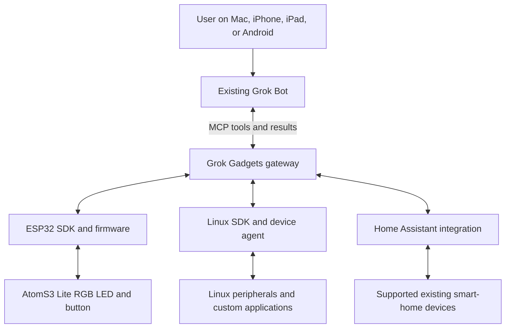

# Grok Gadgets — implementation and launch plan

**Plan date:** 4 October 2026  
**Status:** Historical implementation handoff; the local alpha is now built. See [current verification](verification/launch-status.md) and [publication sanitization](verification/publication-sanitization.md).
**Current authorized phase:** Local development, testing, and incremental Git commits in a separate build chat.  
**License decision:** Apache-2.0 for original code.  
**Community:** [r/GrokGadgets](https://www.reddit.com/r/GrokGadgets/)

This document is the standalone handoff for the build chat. Read the whole plan before implementation. It records the user's decisions, proposed implementation details, acceptance criteria, and the boundary between local work and later public actions. A previous unrequested prototype was rolled back; do not assume its files, tests, or implementation still exist.

## 1. Product definition

Grok Gadgets is an independent, entirely open-source hardware ecosystem **exclusively for Grok**, especially the user's existing Grok Bot. It provides SDKs and integrations through which people connect physical devices, read their state, and operate their supported capabilities.

Its audiences are:

1. Makers building ESP32 gadgets.
2. Developers connecting Raspberry Pi and other Linux computers.
3. Existing Home Assistant users connecting supported devices they already own.
4. Beginners following a small set of tested, well-documented hardware examples.

The reference experience is Muse Gadgets: separately usable Linux and ESP32 SDKs, working examples, clear setup, and a public community. This is a reference for the breadth and usability of the project, not a promise of identical native pairing, avatar, voice, or conversation features. Those depend on separately verified Grok capabilities.

Grok Bot is the only assistant platform. Do not add other AI model backends, entry points or integrations; use only Grok Bot and SpaceXAI technology.

### First concrete example

The target is **M5Stack AtomS3 Lite, model C124**, plus a USB-C **data** cable. The user has not purchased it yet.

The example must eventually let the user:

- Ask Grok Bot to change the built-in RGB LED colour or turn it off.
- Ask Grok Bot for device availability and current reported state.
- Read real button presses through the integration.
- Understand when the device is disconnected or an action is unconfirmed.

Start with a software simulation while the user arranges the board. The first physical path should use USB to reduce setup complexity; Wi-Fi is the next transport milestone. Both are within the eventual ESP32 SDK direction.

### Product promises and limits

- Build separate, independently useful SDKs for ESP32 and Linux.
- Use existing Home Assistant capabilities wherever they meet the need.
- Preserve existing household controls where the underlying integrations permit it.
- Work through the same Grok Bot on supported desktop and mobile clients, once that path is verified.
- Give contributors reproducible builds, tests, examples, and useful diagnostics.
- Keep the software self-hostable and open source, including any eventual hosted-service implementation.
- Do not claim universal smart-home compatibility, universal mobile feature parity, physical operation, or native Grok device pairing without evidence.
- Do not substitute a separate Grok developer-API conversation for the existing Grok Bot without explicitly presenting that product change to the user.

## 2. Settled decisions and execution boundaries

| Decision | Agreed direction |
| --- | --- |
| Name | Grok Gadgets |
| AI integration | Exclusively Grok; existing Grok Bot is the primary target |
| Repository count | Five independent repositories |
| SDK structure | Separate Linux and ESP32 SDK repositories |
| Website location | Main project repository |
| Original code license | Apache-2.0 |
| First hardware | M5Stack AtomS3 Lite C124, built-in RGB LED and button |
| First testing | Software simulation; hardware not yet available |
| Infrastructure now | Local and self-hosted; no paid infrastructure |
| Hosting later | Optional hosted connection remains a future product direction |
| Git workflow | `main`, short-lived feature branches, and release tags |
| Commit policy | Small, coherent, tested increments; no one-commit project dump |
| Community source of truth | GitHub, with Reddit pointing to canonical material |
| Contributor flair | Opt-in account linking, verified merged contribution, automatic award through an approved route |
| Publication | Ask before public repository creation, pushing, package/release publication, deployment, or community changes |

### Authorized in the local build chat

- Inspect the local environment and applicable instructions.
- Create the five local Git repositories in an appropriate project workspace.
- Install necessary local development dependencies.
- Implement, build, run, and test local software.
- Create feature branches, worktrees where useful, and incremental local commits.
- Research official documentation and public reference projects.
- Use coordinated subagents for the subtasks described here.
- Build a local website preview.
- Prepare GitHub configuration, release artifacts, community drafts, and publication instructions.

### Not authorized by this plan

- Creating public repositories or pushing to a remote.
- Publishing packages, release artifacts, or a public website.
- Deploying a public gateway, tunnel, or service.
- Purchasing hardware, domains, subscriptions, or infrastructure.
- Making paid developer-API calls without separate authorization.
- Changing subreddit settings, awarding live flair, posting, commenting, or sending messages.
- Installing a live Reddit app or activating unattended automation.
- Creating recurring agent tasks or additional user-visible sessions.

Prepare external actions fully enough to review before asking for authorization. Do not stop independent local work simply because a later external step needs approval. Conversely, do not treat a prepared configuration as an activated service.

Use Chrome or the permitted built-in browser. **Never open Brave or Safari. Never access the Passwords app.** If a required step would need the Passwords app, stop that step and ask the user what to do.

### Definition of success for this build phase

The immediate objective is a **usable, tested local alpha and a reviewable publication package**. Complete every independently achievable local milestone. Record hardware, Grok-account, Linux-runtime, or publication dependencies accurately rather than waiting indefinitely or silently marking them complete.

The local phase can finish while later external gates remain open. That does not mean the full public ecosystem is launched or physically verified.

## 3. Five repositories and their boundaries

Use a parent workspace containing five sibling repositories. The parent need not be a sixth Git repository. Do not create nested repositories inside the main repository.

```text
GrokGadgets/
  grok-gadgets/
  grok-gadgets-gateway/
  grok-gadgets-linux-sdk/
  grok-gadgets-esp32-sdk/
  grok-gadgets-home-assistant/
```

Each repository must be understandable and usable independently. A contributor should not have to clone the whole ecosystem for a small documentation or SDK change.

### 3.1 `grok-gadgets`: project hub, website, and community

Owns:

- Project overview and repository navigation.
- Cross-project architecture and decision records.
- Overall roadmap and cross-repository dependencies.
- Compatibility manifest identifying tested component versions.
- Shared contributor, community, and release policies.
- Integration acceptance-test orchestration.
- Public-facing website source and source-driven project data.
- Reddit configuration proposals and community-automation source.

Suggested structure:

```text
README.md
LICENSE
AGENTS.md
CONTRIBUTING.md
CODE_OF_CONDUCT.md
SECURITY.md
docs/
  architecture/
  decisions/
  getting-started/
  verification/
community/
  README.md
  guidelines.md
  contribution-recognition.md
  moderation-policy.md
  reddit-setup.md
  content-plan.md
  automation/
planning/
  issues/
  milestones.yaml
compatibility/
  tested-components.yaml
integration-tests/
website/
.github/
```

The tree is a proposed organization, not a requirement to add empty placeholder files. Create files when they contain useful, specific content.

### 3.2 `grok-gadgets-gateway`: Grok and device connection point

Owns:

- Grok-facing MCP tools and packaging/configuration guidance.
- Device registration, capability discovery, command routing, and results.
- Authentication and connection lifecycle for the transports implemented.
- Canonical versioned protocol schemas and contract-test fixtures.
- Simulator and explicit simulation controls.
- Diagnostics, redacted support reports, and local service deployment.

The gateway is not the Linux SDK. It receives connections and serves Grok-facing tools; the SDK helps a Linux application implement a gadget.

Keep assistant tooling, domain behaviour, and transport code separable. A simulated device and a physical device should implement the same relevant capability contract without leaking simulation controls into normal device operations.

### 3.3 `grok-gadgets-linux-sdk`: Linux gadget development

Owns:

- A library for declaring device identity and capabilities.
- Command handlers and state/event reporting.
- A runnable device agent and examples.
- Reconnection, startup configuration, and service instructions.
- Installation, configuration, and troubleshooting documentation.
- SDK tests and gateway contract tests.

Start with a small example that a developer can modify. Do not declare a general SDK complete based on one hard-coded application. Test Linux support in a real Linux environment where available; running Python or Node on macOS alone is not Linux validation.

### 3.4 `grok-gadgets-esp32-sdk`: ESP32 gadget development

Owns:

- Reusable firmware interfaces for capabilities, commands, state, and events.
- C124 board definition and the RGB LED/button example.
- USB transport first, with networked operation developed as a subsequent slice.
- Buildable firmware, toolchain pinning, and recovery/flashing instructions.
- Unit or host tests for logic where practical, firmware compilation, and contract fixtures.

Verify pins and component details from M5Stack documentation. Do not confuse the AtomS3 Lite C124 with ATOM Lite or the display-equipped AtomS3.

Reuse ESPHome or manufacturer-supported libraries where they help, while still delivering the separately usable SDK the user requested. Document whether an example is an ESPHome recipe, a library consumer, or standalone firmware.

### 3.5 `grok-gadgets-home-assistant`: existing homes

Owns:

- A tested Grok connection recipe for Home Assistant.
- Compatibility evaluation of Home Assistant's existing MCP server.
- Any necessary missing adapter/client code, with a documented reason for its existence.
- Setup instructions, exposed-entity guidance, and test fixtures.
- Verification with selected devices when a real installation is available.

Home Assistant is an integration platform rather than a hardware architecture. Name and document this repository accordingly. If upstream support already solves a capability, contribute compatibility tests and onboarding rather than writing a redundant server merely to fill the repository.

## 4. Architecture and transport decisions



This diagram expresses intended responsibilities. The Home Assistant route may use upstream MCP directly where that is the better verified integration; it does not have to pass through a redundant gateway hop.

### Questions the feasibility work must answer

1. Which current Grok Bot extension route supports the required tools?
2. Where does the MCP process actually run: the user's local computer or Grok Bot's cloud computer?
3. What authenticated connection can reach the user's self-hosted device service?
4. Which desktop/mobile clients can use the configured connection?
5. Is arbitrary outside messaging or event-triggered waking of an existing Bot supported?

A standard MCP implementation is necessary evidence, but it is not proof of real Grok Bot interoperability. Record the exact client, transport, configuration, authentication, and observed result.

### Local and remote operation

- A local test client may use stdio or a loopback network server.
- A cloud command cannot launch a path that exists only on the user's Mac. The cloud computer's internet connection does not expose a private LAN.
- Separate Execution on Local Computer can run an enabled, approved Mac command. With LAN reachability and configured SSH, it can reach a Pi. This is a possible manual experiment, not accepted Grok Gadgets support or packaged MCP. USB alone does not create the route.
- A remote connection requires an authenticated, reachable endpoint or another explicitly supported route.
- Do not silently expose local ports to the internet to make a demo work.
- A gateway running on a Mac or Pi must remain on for that path to work. Closing a Grok client does not necessarily stop the gateway; shutting down the gateway host does.
- Local device controls and ordinary Home Assistant automations should not depend on a Grok conversation remaining open.

### Shared protocol

Keep the canonical schema in the gateway repository. SDKs consume a pinned version or generated artifacts with an identified source version; do not hand-maintain conflicting definitions.

Initial protocol concepts:

- Device ID, model, firmware/SDK version, and protocol version.
- Capability names and schemas.
- Command ID, arguments, status, and error details.
- Reported state, observed time, and freshness/availability.
- Button press/release events, identifiers, order, and cursor semantics.
- Session/boot identity so clients can distinguish a restart from a duplicate.
- Reconnection, timeout, retention, and history-loss behaviour.

Use bounded queues and document event retention. A cursor must not silently return misleading results after history is dropped or the server restarts.

### Execution and acknowledgement

Keep these distinct in code and documentation:

```text
requested -> accepted -> device reports execution -> physical effect observed
```

The last step may be a human observation during early testing. Firmware acknowledgement alone does not prove an LED physically illuminated.

Simulation must always identify itself. Test-only button injection and disconnect controls must be explicitly enabled or provided through a separate test interface.

### Authentication and ownership

The local simulator can remain local and require no cloud account. Any network exposure must implement the access controls appropriate to that deployment before it is offered to users.

Plan for distinct device credentials, revocation, authorized device access, and redacted logs. Keep secrets outside Git. Do not present a local single-user prototype as a multi-user hosted service.

Hosted deployment remains a future option using the same open-source core. Do not implement a paid cloud dependency or require a managed service for the local alpha.

## 5. Open-source foundations

Every repository should become contribution-ready from its first substantive commit:

- Apache-2.0 license for original code, with dependency notices preserved.
- README with purpose, exact current status, setup, example use, and limitations.
- `AGENTS.md` describing allowed work, repository boundaries, checks, and commit expectations.
- Contribution instructions that a newcomer can follow.
- Links to shared code of conduct and community policies, plus local additions where relevant.
- Security reporting instructions with a real contact route or an explicit pending-publication item; do not invent an email address.
- Issue forms, pull-request template, and ownership guidance.
- Formatting/linting, build, and meaningful tests.
- Dependency pinning/lockfiles and reproducible toolchain setup where appropriate.
- Release notes and versioning conventions.

Do not copy third-party logos, restricted avatars, or proprietary assets into the project merely because their surrounding code is open source. Keep the project's community affiliation clear.

### Shared policy ownership

Store canonical shared policies in the main repository. Component READMEs and contributor instructions should link to those policies and explain component-specific commands. Avoid five drifting copies of the same policy.

During local development, use resolvable local documentation references or clearly identified unpublished references. Validate final public links when a GitHub owner is selected.

## 6. Branches, commits, releases, and checks

### Branch model

- Use `main` as the integration branch.
- Use short-lived branches for features, fixes, documentation, and experiments.
- Use version tags for genuine releases or clearly marked prereleases.
- Do not create permanent `dev` and `prod` branches initially.
- Treat preview/production as deployment environments, not duplicate source histories.

### Commit discipline

For each coherent work item:

1. Establish the relevant baseline and acceptance criteria.
2. Implement a bounded change.
3. Run the change's checks and regression checks that protect prior functionality.
4. Review the diff for unintended changes and secret exposure.
5. Commit with a clear message and a local issue reference.
6. Update the issue and evidence record.
7. Proceed to the next part.

Before commit N+1 is accepted, checks relevant to the functionality established through commit N must still pass. Broaden tests when interface changes or new failures justify it. Do not defer all tests until the final integration.

Preserve meaningful incremental commits. Do not dump the ecosystem into a single final commit or squash away all progress at first publication. Do not make empty commits merely to increase the count.

If a check cannot run, explain why and what evidence is missing. Do not label it passed. If a code defect breaks a check, resolve it before progressing with dependent work.

### Local versus GitHub enforcement

Local repositories can have checks, hooks, workflows, templates, and a desired-protection configuration. GitHub protections and hosted status checks are not active until the repositories exist remotely and are configured.

Prepare protection settings for:

- Pull requests into `main`.
- Passing required checks with unambiguous names.
- Resolved review conversations.
- No force-push or deletion of `main`.
- Review requirements appropriate to actual available maintainers.

Do not create an impossible review rule requiring a second human who does not exist, or pretend an agent self-review is an independent human approval. Present the launch configuration for review.

### Releases and compatibility

Version each component independently. Keep a main-repository compatibility manifest recording exact component tags or commit IDs, protocol version, test environment, and verification result.

Release readiness includes changelog, installation instructions, compatibility notes, build provenance/checksums where relevant, and rollback/recovery guidance. Tags should identify tested release snapshots, not every ordinary commit.

## 7. Roadmap and managed issues

### Local phase

Use a structured local issue ledger until publication is authorized. Keep issue files with their owning repository and cross-project coordination in the main repository.

Each issue needs:

- Stable local ID and owning repository.
- Problem, intended behaviour, and acceptance criteria.
- Dependencies and related cross-repository issues.
- Type, area, priority, and contribution labels.
- Milestone and current stage.
- Related commit IDs.
- Verification evidence or remaining blockers.

Recommended label groups:

| Group | Initial labels |
| --- | --- |
| Type | `bug`, `feature`, `docs`, `research`, `maintenance` |
| Area | `protocol`, `gateway`, `linux`, `esp32`, `home-assistant`, `website`, `community` |
| Priority | `P0`, `P1`, `P2` |
| Contribution | `good first issue`, `help wanted`, `needs hardware` |

Use stages: **proposed, ready, in progress, review, blocked, done**. Track why an item is blocked and what unblocks it. A documentation task may be done while its linked hardware test remains blocked; do not collapse those into a misleading single status.

### Publication phase

When authorized, migrate local issues to their GitHub repositories, retain a local-to-GitHub ID mapping, apply labels and milestones, and create one overall project board. GitHub then becomes authoritative for issue status; local records should not continue as an independent conflicting tracker.

Use cross-repository parent issues for coordinated changes and linked component issues for implementation. Update and respond to issues as work progresses. Close only when acceptance criteria are met.

## 8. Milestones, deliverables, and acceptance gates

### M0 — Inspect, bootstrap, and establish contracts

Deliver:

- Workspace inspection and a brief environment report.
- Five local repositories with contribution foundations.
- This plan incorporated into the main repository, with decision records for implementation choices.
- Local backlog and a dependency map.
- Repeatable developer commands and initial checks.

Gate: a contributor can identify each repository's purpose, run its applicable initial checks, and find the next work item. No fabricated success badges or unsupported platform claims.

### M1 — Feasibility investigation and protocol

Deliver:

- Current official Grok Bot integration findings.
- A concrete authentication/transport experiment and its prerequisites.
- Initial schemas, capability model, protocol version, and contract fixtures.
- Written event and acknowledgement semantics.

Gate: protocol tests pass and the connection route is either experimentally verified or clearly documented as an open dependency. Raise fundamental problems early. Do not silently replace the intended Bot with a different runtime.

### M2 — Gateway and software simulator

Deliver:

- A simulated C124 with LED state, button edges, and availability.
- Grok-facing MCP tools for discovery, state, control, and event reads.
- Explicitly separated test controls.
- A local demo and an MCP client integration test.
- Useful, redacted diagnostics.

Gate: a real MCP client performs discovery, LED control, button reads, disconnect/error handling, and reconnects. Results say they are simulated. A printed `PASS` must be backed by assertions and observed responses.

Suggested incremental commits: foundation; protocol; device simulator; MCP tool surface; lifecycle/error handling; diagnostics and demo. The exact split should follow coherent changes.

### M3 — Linux SDK and device agent

Deliver:

- Independently installable SDK and capability registration API.
- Command dispatch, state/event reporting, and reconnect handling.
- Example device program and service setup.
- Tests against the shared protocol fixtures and gateway.

Gate: an example developer can register a capability and handle a command without modifying the gateway. Report the actual runtime/OS tested. A real Linux acceptance run remains required before labeling Linux support verified.

### M4 — ESP32 SDK and C124 firmware

Deliver:

- Reusable SDK interfaces and explicit C124 board support.
- LED/button example and USB communication path.
- Reproducible build with pinned toolchain/dependencies.
- Flashing, provisioning, and recovery instructions.
- Host-side logic tests or protocol fixtures where practical.

Gate: firmware compiles and integration logic passes applicable tests. Label the board **build verified, hardware pending** until physical tests occur. Wi-Fi can follow as a separate issue after the first transport works.

### M5 — Real Grok and cross-device integration

Current stage: **blocked**. M5 Actual Grok needs supported invocation and reload evidence for the exact kit, plus the authenticated remote route. Local `serve` is implemented; secure remote access and verified Grok Bot invocation remain incomplete.

Run this as soon as M2 permits; it should not wait for all other SDK work.

Deliver:

- Configuration of the verified extension route, when authorized account access is available.
- Grok tool discovery and simulated-device operation.
- Evidence from supported desktop/mobile clients where available.
- A description of which host must remain running.

Gate: the real Bot invokes tools and returns results reflecting the simulator, rather than simply describing what it would do. Record client versions and exact test conditions. If unavailable, keep this gate open and complete other local work.

### M6 — Home Assistant integration

Deliver:

- Evaluation of upstream MCP support and a documented reuse decision.
- Necessary configuration/client/adapter components.
- Repeatable tests against fixtures or a local test installation.
- Instructions for exposing a small set of entities.

Gate: demonstrate the available integration path at its actual evidence level. Real-light or sensor claims require a real installation and physical checks. Do not claim every Home Assistant entity or vendor-specific feature is exposed through Assist/MCP.

### M7 — Website and community preparation

Deliver:

- Local website with documentation, project status, and contribution paths.
- Source-driven roadmap and GitHub-data integration using labeled local fixtures before publication.
- Canonical community documents.
- Reddit audit procedure, proposed configuration, initial post drafts, and flair-automation design.

Gate: website checks pass, local preview is reviewed at desktop/mobile sizes, and all external-facing changes are ready to review. Nothing is published or modified on Reddit during this phase.

### M8 — Physical verification and independent installation

Current stage: **blocked**. M8 Physical and independent verification needs a real Pi or device setup, observed peripheral operation, and independent reproduction.

Requires hardware and a second tester; prepare the procedure during local development.

Deliver:

- Exact C124 firmware and host version record.
- Visible LED changes and real button-event results.
- Unplug/reconnect, reboot, and stale-state tests.
- Another person's installation report using their own account/device.

Gate: observed physical results and independently reproducible instructions. Do not represent simulator evidence as hardware evidence.

### M9 — Publication and release readiness

Deliver before requesting authorization:

- Repository inventory and meaningful commit history.
- License/notice review and secret scan.
- Issue migration and GitHub protection/configuration package.
- Release notes, artifacts, compatibility record, and known limitations.
- Website deployment plan and community before/after proposals.
- Explicit list of remaining hardware/account gates.

After authorization only: create/push repositories, activate protections/CI/issues, publish the site/releases, and apply approved community changes. Re-check actual results and preserve evidence of what was activated.

## 9. Verification strategy

Use these terms consistently in READMEs, issues, releases, and the website:

| Evidence level | Meaning |
| --- | --- |
| Simulated | Behaviour passed against a simulated device |
| Build verified | Software/firmware compiled in the recorded environment |
| Grok verified | A real Grok Bot used the tools successfully |
| Hardware verified | The exact physical device performed the operation |
| Independently reproduced | Another person followed the public instructions successfully |

These levels are complementary, not interchangeable. A component may have several while another remains pending.

### Required test categories

- Invalid device IDs and malformed command arguments.
- RGB bounds and input validation.
- Button edges, event order, duplicate reads, retention, and cursor reset/history loss.
- Offline commands, timeouts, unknown/stale state, and recovery.
- Server and device restarts.
- Retry behaviour and duplicate command handling.
- SDK/protocol version mismatch.
- Credential revocation and unauthorized device access for implemented network paths.
- Default absence or explicit separation of simulation controls.
- Installation from documented commands in a clean environment.
- Cross-repository integration using recorded component commits.

Tests should verify behaviour and failure modes, not merely mirror implementation. Do not write a large test suite for trivial static edits. Hardware-specific tests must remain explicitly pending when no hardware exists.

### First physical demo script

1. Confirm the model and firmware build.
2. Discover the C124 through the integration.
3. Request green LED output and visibly verify it.
4. Change colour, then turn it off.
5. Press and release the physical button and inspect the returned events.
6. Disconnect the board and request another command; verify an honest error/unconfirmed result.
7. Reconnect and verify recovery without reinstalling.
8. Restart the relevant host/device and verify documented state/event behaviour.
9. Repeat through the real Grok Bot, then available mobile clients.

Record timestamps, versions, tool results, and physical observations. Avoid capturing credentials in logs or videos.

## 10. Website plan

### Source and publishing model

Place the website in `grok-gadgets/website`. Prefer a static site generated from repository content and suitable for later GitHub Pages hosting. Select a maintainable framework and record the decision; do not introduce a paid content-management dependency.

Main-repository documentation is canonical for shared content. Component documentation stays owned by its component repository. Import pinned versions or link to versioned pages rather than silently mixing incompatible latest documentation.

GitHub Pages can host generated site assets. It cannot host the gadget gateway or a persistent account-linking service.

### Information architecture

- Home: purpose, current stage, and honest first-use paths.
- Getting started: ESP32, Linux, Home Assistant, and beginner choices.
- Hardware: exact board, accessories, supported capabilities, and evidence level.
- SDK documentation: installation, APIs, examples, and version compatibility.
- Architecture: how Grok, gateway, and SDKs interact.
- Roadmap: active milestones, blocked work, and contribution opportunities.
- Releases: changelog, artifacts, compatibility, and known limitations.
- Community: Reddit link, guidelines, contribution instructions, and recognition policy.
- Project activity: repository statistics and links to source records.

### Project activity data

Display actual data once public repositories exist:

- Stars per repository and clearly labeled aggregate star count; do not imply the aggregate represents unique people.
- Open issues, excluding pull requests.
- Releases and their dates.
- Contributors, deduplicated when displaying a cross-repository count.
- Active contributors under a published definition, initially contributors with a merged PR in the previous 90 days, excluding automation accounts where identifiable.
- Milestone stages linked to their underlying issues/project records.
- Last successful refresh time.

Use obviously labeled fixtures during local development. Do not present sample counts as live activity. Use bounded refreshes, caching, and fallback states. Never place access tokens in client-side JavaScript. Validate untrusted issue/profile content before rendering it.

Documentation should rebuild after relevant approved source changes. Project statistics can refresh on a bounded schedule after deployment is authorized. If a fetch fails, show a timestamped cached result or an unavailable state rather than silently displaying stale data as live.

### Visual direction and motion

Reference: [Paradigm](https://paradigm.xyz).

During implementation, inspect its current typography, layout, transitions, and motion using permitted tools. Create an original visual system inspired by its character. Do not copy branding, illustrations, or proprietary assets.

Use motion to explain navigation or add purposeful visual character. Preserve readable text, keyboard access, reduced-motion behaviour, touch usability, and a responsive layout. Test animation performance and loading behaviour. Avoid decorative motion that makes documentation harder to use.

### Website acceptance

- Works locally from documented commands.
- No broken internal links or accidental links to nonexistent public repositories.
- Source-derived docs and roadmap render correctly.
- Fixture/unavailable/live states are clearly distinguishable.
- Desktop and narrow mobile layouts are visually checked.
- Keyboard navigation and reduced-motion mode are usable.
- Production build completes without embedding secrets.

## 11. Reddit and community operations

### GitHub as source of truth

Keep community guidelines, contributor instructions, recognition rules, moderation guidance, and release details in the main repository. Reddit should link people to canonical documents rather than host unrelated copies that drift.

Public policies can be open source. Account-linking secrets, private moderation notes, and personal account mappings are operational data and must not be committed publicly.

### Future subreddit audit

The user will provide a logged-in Chrome session when this work is authorized. Inspect the actual state of [r/GrokGadgets](https://www.reddit.com/r/GrokGadgets/) rather than assuming it is empty.

Inventory:

- Existing description, rules, appearance, sidebar/menu links, and welcome material.
- Existing post/user flairs.
- Moderator permissions and available tools.
- Pinned posts and current content.
- Existing settings that should be preserved.

Produce a concise audit with recommendations and a before/after change list. Preserve the user's existing description and work unless the proposed change improves it and is approved. Live changes are outside the local build authorization.

### Proposed post flairs

- Announcement
- Release
- Build showcase
- Help / troubleshooting
- Idea / proposal
- Guide
- First build
- Contribution opportunity

### Proposed user flairs

- Community member
- Contributor
- Maintainer
- Hardware tester

Contributor and Maintainer are verified roles. Define eligibility for Hardware tester before issuing it. A GitHub `good first issue` label and a Reddit `First build` flair have different purposes.

### Contributor-flair automation

Agreed direction: opt-in linking, verified merged contribution, then automatic award through a permitted integration.

Required sequence:

1. Person explicitly requests recognition and consents to linking.
2. Verify ownership of both Reddit and GitHub accounts using supported identity flows or a documented proof process.
3. Verify at least one eligible merged contribution to the project repositories. Include documentation and tests, not only code.
4. Apply the Contributor flair through a permitted moderator/app capability.
5. Record the award outcome and allow correction or unlinking.

Never infer identity from matching usernames. Do not publish account mappings without consent. Ordinary participation, opening an issue, or an unmerged PR does not automatically satisfy the initial merged-contribution rule; other recognition can be defined separately.

Implementation requirements:

- Dry-run mode and a reviewable decision log.
- Idempotent awards and bounded retries.
- Handling for renamed/deleted accounts and revoked authorization.
- Manual override and a documented unlink/data-deletion policy.
- Preserve higher-priority moderator/maintainer flairs.
- Avoid broad GitHub access; use the least access sufficient for verification.
- Test with fixtures locally before any live integration.

Evaluate Reddit's current developer platform and API requirements before choosing a runtime. Approved access, app permissions, or external-fetch restrictions may affect the implementation. Do not promise unrestricted unattended automation, and do not use browser automation to work around denied API access.

The automation source belongs in the main repository; no sixth repository is necessary. A live identity-linking backend is not provided by a static website. If deployment would require new infrastructure or permissions, prepare it and leave activation pending.

### Initial community content

Prepare, but do not publish:

- A welcome/start-here post explaining the actual project stage.
- A contribution guide post pointing to GitHub.
- A prototype update grounded in actual test evidence.
- A first-build/help thread proposal.

Do not advertise an untested firmware build as working hardware, or an unverified Grok route as supported.

### Ongoing agent-assisted operations

Document future duties: issue triage, broken-link checks, contributor recognition, release-draft preparation, community questions, and moderation escalation.

An ongoing service needs a defined runtime, schedule, credentials, permissions, failure reporting, and human escalation. An agent does not continue working merely because a session contains a plan. Do not create automations now.

Distinguish routine administrative actions from posts, user contact, bans, or other consequential moderation. The latter need explicit operational authorization and policy. Avoid unsolicited outreach or automated promotional spam.

## 12. Subagent organization and coordination

Use one coordinator in the build chat. Use subagents for bounded tasks and respect available concurrency limits. Separate user-visible chats require explicit user authorization; they are not the default.

Suggested workstreams:

| Workstream | Primary responsibility | Dependency |
| --- | --- | --- |
| Coordinator | Decisions, contracts, integration, issue state, accurate reporting | None |
| Gateway/protocol | Schemas, simulator, tools, connections | Initial architecture |
| Linux SDK | SDK, device agent, examples | Agreed protocol |
| ESP32 SDK | Board support, firmware, transport | Agreed protocol |
| Website/docs | Main hub, documentation, UI, project data | Agreed content/data contracts |
| Home Assistant/community | Upstream integration evaluation and community preparation | Can partly run independently |

These are workstreams, not a request to exceed the environment's simultaneous-agent limit. Rotate assignments as slots become available.

### Parallel work rules

- Establish contracts before dependent agents implement different versions of them.
- Give agents repository or file ownership to prevent conflicting edits.
- Keep shared interfaces under coordinator review.
- Communicate proposed breaking changes before adopting them.
- Use isolated branches/worktrees for concurrent edits where appropriate.
- Integrate only tested component commits, then run cross-repository checks.
- Agents may communicate directly through supported collaboration tools.

Each handoff must report repository, branch, commit IDs, changes, tests, interface changes, unresolved issues, and the next agent's prerequisites.

The coordinator remains responsible for verifying integration and completion claims. A subagent saying "done" is not a substitute for acceptance evidence.

### Agent reasoning policy

Choose the effort a task needs. Use high effort for cross-repository contracts, authentication, concurrency, recovery and unresolved failures. Research tasks use the strongest available reasoning and cite primary sources. More reasoning never replaces tests, physical evidence or current documentation.

Record the actual delegation in handoffs. Development tooling is not part of the product and is not named in the repository.

## 13. Implementation decisions the build chat should make

No more product questions are required to start local work. The build chat may choose maintainable languages, libraries, packaging, and static-site tooling based on the actual environment and current official documentation.

Record decisions that affect contributors or interfaces:

- Gateway runtime and official MCP SDK choice.
- Linux SDK language and supported runtime range.
- ESP32 framework/toolchain and how C124 support is maintained.
- Shared schema format and code-generation/versioning approach.
- USB framing and later network transport.
- Test environments and local integration orchestration.
- Static-site framework and GitHub-data build strategy.

Prefer a small, understandable stack over unnecessary infrastructure. Do not ask the user to choose low-level tooling unless it changes product scope, cost, or access requirements.

## 14. Progress reporting and final local handoff

At each meaningful milestone, report:

- What is now usable.
- Repositories/branches and significant commits.
- Tests run and actual results.
- Remaining limitations and blockers.
- Issue/milestone status.
- The next concrete step.

Final local handoff must include:

1. Paths to the five repositories and their commit histories.
2. A simple start command or clearly ordered setup commands.
3. A working simulator demo and MCP acceptance evidence.
4. SDK and integration evidence at its actual verification level.
5. C124 firmware build output and flashing instructions, if buildable.
6. A local website preview and build instructions.
7. Maintained backlog, roadmap, and cross-repository dependency records.
8. Community policies, Reddit audit/setup package, and tested local flair logic where implemented.
9. Publication configuration and a concrete proposed release state.
10. A short list of exactly what still requires hardware, account access, Linux execution, independent testing, or publication approval.

Do not call the entire public ecosystem complete while those gates remain open. Do not leave independently achievable local work unfinished merely because a later milestone is blocked.

## 15. Deferred user inputs

These are not blockers to local implementation:

- GitHub owner/organization and authorization to create/push repositories.
- Website domain choice, if any; no domain purchase is implied.
- Grok Bot account access for end-to-end testing.
- An authenticated remote connection route if the real Bot cannot use the local path.
- Physical C124 availability and flashing authorization.
- A real Home Assistant installation and selected test devices.
- A second tester for independent reproduction.
- Logged-in Reddit moderator access and approval of concrete changes.
- Reddit developer-platform permissions and deployment authorization.
- Optional future hosted-service operating budget.

Ask for these when the dependent action is ready, with a concrete explanation. Do not repeatedly reopen the settled decisions in Section 2.

## 16. Primary references for implementation-time verification

These are reference links, not evidence that an integration has passed tests. Re-check current documentation before relying on changing product behaviour.

- [Muse Gadgets](https://gadgets.muse.ai/)
- [Muse gadget SDK source](https://github.com/facebookincubator/muse-gadget-sdk)
- [M5Stack AtomS3 Lite](https://docs.m5stack.com/en/core/AtomS3-Lite)
- [Grok Bot overview](https://docs.x.ai/grok-bot/overview)
- [Grok Bot mobile](https://docs.x.ai/grok-bot/mobile)
- [Grok Bot custom MCP documentation within Team Bots](https://docs.x.ai/grok-bot/team-bots)
- [Home Assistant MCP server](https://www.home-assistant.io/integrations/mcp_server/)
- [ESPHome](https://esphome.io/)
- [GitHub branch protections](https://docs.github.com/en/repositories/configuring-branches-and-merges-in-your-repository/managing-protected-branches/about-protected-branches)
- [GitHub Pages](https://docs.github.com/en/pages/getting-started-with-github-pages/what-is-github-pages)
- [Apache License 2.0](https://www.apache.org/licenses/LICENSE-2.0)
- [Paradigm design reference](https://paradigm.xyz)
- [Grok Gadgets subreddit](https://www.reddit.com/r/GrokGadgets/)
- [Reddit developer platform](https://developers.reddit.com/)
- [Reddit Data API guidance](https://support.reddithelp.com/hc/en-us/articles/16160319875092-Reddit-Data-API-Wiki)

## 17. Completion checklist

- [ ] Five local repositories, each with an understandable purpose and contribution foundation.
- [ ] Apache-2.0 original-code licensing and third-party notices.
- [ ] Meaningful incremental commits and working developer checks.
- [ ] Versioned protocol and SDK compatibility tests.
- [ ] Working gateway/simulator and actual MCP client evidence.
- [ ] Useful Linux SDK example with accurately stated tested platforms.
- [ ] Buildable C124 firmware or a precisely diagnosed toolchain blocker.
- [ ] Home Assistant reuse decision and tested integration components.
- [ ] Local website with honest status, documentation, roadmap, and data states.
- [ ] Source-controlled community policies and Reddit preparation.
- [ ] Opt-in contributor-flair design and relevant local tests.
- [ ] Maintained labeled backlog, milestones, and cross-repository dependencies.
- [ ] Documented actual Grok/hardware/mobile verification status.
- [ ] Concrete publication package awaiting explicit approval.
- [ ] Final handoff clearly separates local completion from public launch and physical support.

The governing question for each release is: **What can another person successfully do from our instructions, without private maintainer intervention, and what evidence supports that claim?**
