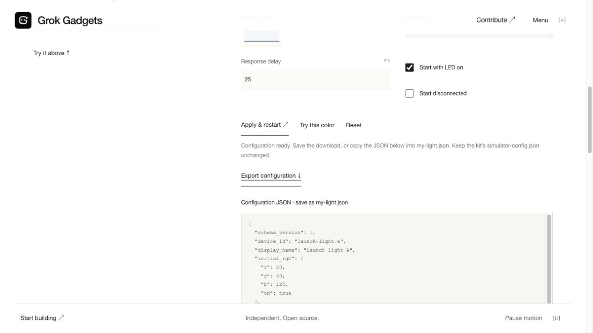

# Visual sources and evidence

Original project vectors, created from maintained architecture and board records. Each flow has an editable `.mmd` source; SVG cards provide an accessible static explanation rather than a runtime-dependent diagram. Read order follows the visible numbers. The contribution and no-hardware sequences are ordered; the responsibility map lists separate owners.

The overview lists the browser, export, kit, gateway and SDK software. Grok native receipts, the authenticated cloud-to-local route and real Home Assistant remain separate pending paths; Home Assistant can connect directly to Grok using upstream MCP. The command lifecycle ends with a distinct physical observation that cannot be inferred from an ACK.

[C124 functional reference](c124-reference.svg) is an original conceptual illustration, not a photograph, dimensional drawing or wiring guide. Pin facts are sourced from the [manufacturer](https://docs.m5stack.com/en/core/AtomS3-Lite) and the pinned [board-source record](https://github.com/adidshaft/grok-gadgets-esp32-sdk/blob/main/docs/board-sources.md) (planned GitHub destination). No physical board was available. Use the build/flash guide before connecting hardware.

This screenshot was captured from the running local website on 5 October 2026, with the actual customization/export panel open. It shows software simulation only, no account information or physical device. The exported `my-light.json` document was saved from the visible JSON fallback; a browser download-event capture timed out. SHA256 of the image: `c3215addc08a33a6d12b72727f9a034ca96c2743bd1ad26159bac70ac39a7dd2`. [Community artwork provenance](brand-provenance.md) distinguishes original artwork from third-party reference marks.
